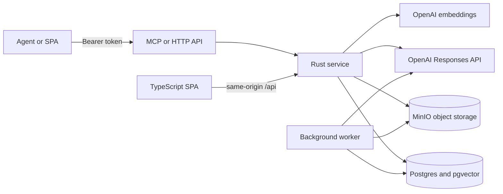

# Straylight Architecture

Status: alpha reference architecture

Straylight is an agent-first context and durable-work service. It preserves
source evidence, learned knowledge, live work state, artifacts, and resumable
checkpoints so that a later agent can inspect, continue, verify, and advance
work without replaying an entire transcript or reconstructing a filesystem.

This document records the implementation architecture. The four initial design
documents in the shared vault remain the governing product inputs; changing
their read, write, or dreaming semantics requires an explicit design decision.

## System Shape

All components run in Docker. Postgres, MinIO, and the API are bound to
localhost by default. Only the SPA is deliberately reachable from the local
network.

## Product Boundaries

- Straylight is not a transcript archive, notes application, synchronized
  folder, generic RAG wrapper, or universal knowledge graph.
- Markdown and source-native files are evidence and import formats, not the
  canonical interaction model.
- Retrieval is an aid to reasoning, not a truth boundary. Complete bounded
  materialization and exact source reads remain available.
- Arbitrary code does not execute inside Straylight. `memory.compute` is a
  bounded declarative surface; capable agents can run additional analysis in
  their own sandboxes after read-only retrieval.
- Online capture and offline dreaming are separate authority paths.

## Ownership And Isolation

The alpha is multi-user without a separate tenant abstraction. Every durable
row belongs directly to one internal `user_id`; scope IDs further constrain
credentials and sessions. There is one shared service deployment, one database,
and one object store.

Isolation is enforced at several layers:

1. Bearer credentials resolve to one user, a capability set, and explicit
   scope grants.
2. Each database transaction installs signed user, credential, capability, and
   scope context.
3. Postgres row-level security independently checks the context on every
   protected table.
4. Queries also constrain user, scope, and immutable corpus revision directly.
5. MinIO keys begin with the owning user ID.
6. Embeddings, caches, jobs, audit events, continuation tokens, and import
   receipts never deduplicate across users.

Read-only credentials retain `open`, `query`, `read`, `compute`, `verify`, and
`status`. Ordinary read/write credentials add corpus mutation, staging,
correction, deletion, checkpoint, and dream capabilities. Credential issuance
and revocation require the separate `credential:manage` owner capability, so a
normal writer cannot mint a more powerful token.

## Durable Model

The logical kernel stays small:

- **Objects** provide stable identity and immutable revisions. Profiles such as
  person, organization, event, arrangement, resource, work item, and artifact
  are composable labels over the same object contract.
- **Claims** carry value, producer, formation method, claim mode, support state,
  authority, canonicality, confidence, valid time, lineage, and direct evidence.
- **Qualified relations** preserve endpoint roles, qualifiers, evidence, and
  revision history. Similarity and aliases never establish identity.
- **Temporal and recurrence specifications** preserve civil time, IANA zones,
  intervals, series rules, stable occurrence identity, and sparse exceptions.
- **Named state machines** keep schedule, participation, attendance,
  notification, booking, payment, allocation, availability, use, execution,
  and validation independent.
- **Sources, evidence, documents, chunks, and assets** retain source-native
  content, hashes, locators, and object-storage lineage.
- **Corpus revisions** are immutable manifests over record versions and
  dispositions.
- **Sessions** pin one credential, authorization scope, policy projection, task
  hash, and corpus revision.
- **Checkpoints** are immutable work-state objects with parent linkage, goals,
  decisions, gaps, gates, next actions, and validated source references.

There is no global lifecycle field. A scheduled event may coexist with
tentative participation, unknown attendance, an unpaid arrangement, and an
unverified work result.

## Read Path

`memory.open` creates a snapshot-pinned session and returns a corpus map,
resolved roots, optional checkpoint and revision delta, bounded complete
materialization when it fits, an initial hybrid evidence set, and the latest
fresh hard-gated learned view for the same immutable revision. Learned items
are labeled `derived_non_authoritative`, retain direct source links, and are
omitted rather than served stale when no candidate exactly matches the pinned
revision. They never replace source evidence or alter absence guarantees.

`memory.query` combines independent exact, structured, PostgreSQL FTS,
pgvector semantic, temporal, and relation lanes. Reciprocal-rank fusion merges
candidates while preserving lane scores and `why_selected`. Authority,
canonicality, freshness, contradiction, and valid time remain visible and are
not collapsed into one truth score.

`memory.read` resolves exact typed references and source-native views,
including current state, full content, ranges, outline, neighbors, relations,
history, diffs, and materialized scope.

`memory.compute` performs bounded filters, joins, groups, aggregations,
timelines, diffs, state history, identity resolution, recurrence expansion,
graph traversal, unit-aware arithmetic, proximity checks, and gate rollups.
Every result carries evidence references or an explicit unsupported status.

`memory.verify` accepts claims plus optional evidence or structured coordinates
and classifies them as supported, contradicted, insufficient, superseded, or
temporally ambiguous. It may discover relevant evidence, but it never treats
arbitrary retrieved text as support without a claim match.

## Write Path

`memory.capture` is the ordinary source-bearing write surface. It accepts one
source body or an existing source reference, scope, optional roots and intent,
an idempotency key, and automatic or draft-only mode. A bounded OpenAI
structured extraction compiles that input into a complete `memory.save`
request. The compiler adds the source episode, exact-span evidence, authority
dimensions, and optimistic base revision, repairs only mechanical schema
mistakes, and runs deterministic state, identity, completion, confidence, and
source-integrity checks. Low-risk validated captures commit once through
`memory.save`; consequential ambiguity returns an inspectable draft without a
corpus mutation. Existing-source capture must prove that the supplied text is
present in, or exactly hashes to, that source.

`memory.save` is the canonical atomic write operation. A save requires an
authenticated user, scope, source episode, policy revision, idempotency key,
and immutable base corpus revision. It validates all items before a transaction,
locks mutable heads deterministically, writes evidence and revisions, advances
the corpus manifest once, appends audit receipts, and queues derivative work.

The operation distinguishes create, revise, supersede, retract, relate, and
tombstone. It does not expose a generic upsert. Proposals, attempted actions,
file presence, and invitations cannot silently become completion or validation.

`memory.stage` places files or archives in an expiring inspection workspace.
Archive members are inventoried individually with traversal, symlink, expansion,
ratio, and size limits. A stage exposes a read-your-writes mini-corpus through
the normal read/query/compute/verify API. Promotion selects explicit entries and
commits a replay-safe import receipt; archives are never indexed as opaque
containers.

Checkpoint convenience calls map to the canonical checkpoint save contract and
do not define a second persistence model.

## Dreaming

Phase 0 dreaming is shadow-only. A job pins an active revision, region, policy,
model, prompt, schema, budget, and expected query families. Deterministic
maintenance and optional deep consolidation can create only source-bearing
candidate views, aliases, soft links, clusters, flags, and review-required
hypotheses.

The worker observes committed corpus revisions and automatically schedules a
debounced refresh after relevant change or inactivity. A successful candidate
must pass every hard gate and its paired retrieval evaluation before
`memory.open` can include its safe, non-review-required derived items. Inclusion
is automatic only while the candidate is fresh for the exact pinned revision;
quarantined, rejected, failed, stale, or review-required material is excluded.

The worker evaluates active and candidate retrieval behavior, policy and
lineage invariants, transition safety, and source preservation. The SPA exposes
the candidate manifest, findings, gates, evaluation, model usage, review
history, and audit trail. Accepting a Phase 0 review records learning but never
mutates the active corpus. Promotion and rollback become meaningful only in a
later phase with a separately approved contract.

## Deletion

Tombstoning is an explicit destructive workflow, not a memory that says
"forget this." The active corpus immediately marks the target tombstoned and
queues propagation. The worker removes affected embeddings, lexical content,
caches, derived surfaces, and unreferenced object blobs; records each surface
individually; and completes only when required targets are removed or retained
for a concrete policy reason. Minimal content-free tombstone and audit records
remain for stale-reference invalidation and proof of propagation.

Controlled content redaction is available only to the administrative worker
while processing a real deletion job. Application database roles cannot enable
the bypass themselves.

## Storage And Services

| Component | Responsibility |
| --- | --- |
| Rust API | contracts, authorization, transactions, retrieval, control plane |
| Rust worker | embeddings, dream jobs, deletion propagation, background repair |
| PostgreSQL 17 | canonical records, immutable revisions, RLS, FTS, jobs, audit |
| pgvector | user-filtered 1536-dimensional semantic embeddings |
| MinIO | versioned user-scoped source and artifact blobs |
| OpenAI | `text-embedding-3-small`, structured online capture, and bounded Phase 0 consolidation |
| TypeScript SPA | capture, exploration, work, dreaming, audit, settings |
| TypeScript MCP | typed batch-first agent operations over HTTP |

## Failure Semantics

- Capability and scope failures are explicit and do not widen access.
- A session never silently advances to a newer corpus revision.
- Unsupported filters or compute semantics fail explicitly rather than running
  a broader query.
- Partial and degraded responses identify unsearched partitions and index lag.
- `no_result` is never evidence of absence unless a maintained-complete
  collection proves the searched boundary.
- Idempotent replays return the original receipt; conflicting payloads return a
  stable conflict.
- Capture model or validation failure returns a source-preserving draft and
  never falls through to an unvalidated write.
- Background work retries with bounded attempts and records terminal failures.

## Deployment Boundary

The local alpha is a faithful reference service, not the final public cloud.
Identity provider selection, account recovery, quotas, rate limits, backup
policy, collaborative ownership, production observability, and commercial
packaging remain deployment decisions. They may not weaken the user, scope,
revision, evidence, or capability contracts above.
