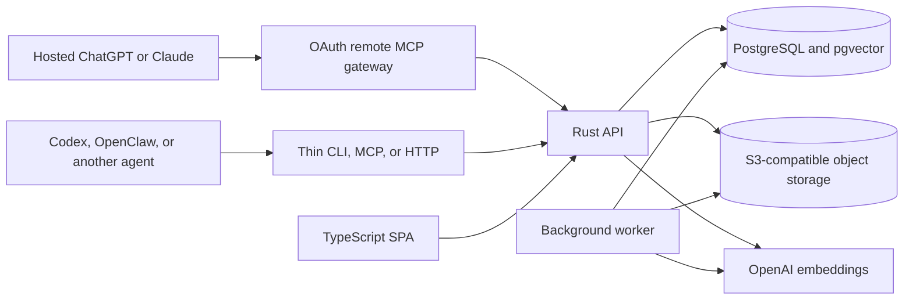

# Straylight Architecture

Status: alpha reference architecture

Straylight is an agent-first workspace and memory service. It provides the
useful behavior of a shared Markdown vault through an online API, then adds
portable retrieval, exact binary access, lightweight history, background
maintenance, usage visibility, and resumable checkpoints.

This architecture is the approved simplification of the owner-alpha design.
The original design documents remain historical product inputs. Where they
conflict with this document, this document governs the implementation.

## Design Priorities

In order:

1. Match or exceed direct Markdown files for reasoning quality.
2. Return useful evidence quickly as the workspace grows.
3. Preserve exact user-authored Markdown and binary bytes.
4. Make ordinary agent work easy to continue and audit.
5. Learn and maintain useful context without hiding changes.
6. Keep failure local, repairable, and inexpensive.

Straylight is not a transcript replay system, a knowledge graph database, a
distributed transaction coordinator, or a replacement reasoning engine. Codex,
OpenClaw, and other agents reason with their own tools after Straylight returns
source material.

## System Shape

All development components run in Docker. PostgreSQL and object storage stay
private. Production uses S3 or another compatible cloud object store; MinIO is
the development implementation.

The remote MCP gateway is a stateless protocol and OAuth adapter, not another
durable store. Each hosted client authorizes with its own root-scoped
read/write Straylight credential. The gateway encrypts that credential into
short-lived OAuth access and rotating refresh tokens and creates a fresh API
client per MCP request. It never has a process-global upstream credential.
Local stdio clients retain the complete 12-tool surface. Hosted clients expose
the ten tools that do not depend on the adapter host's filesystem; hosted
`memory.stage` and `asset.fetch` are deliberately absent.

## Canonical Data

The durable model is deliberately small:

- `users` own data.
- `api_credentials` grant read-only or read/write capabilities.
- `entries` provide stable identity for a path.
- `entry_versions` preserve immutable Markdown content or an exact object-store
  locator for each version. Portable file annotations on the current version
  may be corrected without duplicating identical content.
- `workspace_changes` provide a cheap monotonic generation and changed-path
  feed.
- `search_chunks` hold rebuildable FTS and vector search material for current
  Markdown versions.
- `jobs` represent retryable background work.
- `entry_usage` contains fail-open aggregate access counters.

Current Markdown is current workspace truth. Prior entry versions are history.
Object-store bytes are truth for binary entries. Search chunks, embeddings,
indexes, link maps, people views, event views, task views, and briefings are
derived and rebuildable.

People, events, projects, tasks, logistics, sources, authority, relationships,
and status are Markdown and frontmatter conventions rather than separate
database object hierarchies. The SPA and agents may derive first-class views
from those conventions without creating another source of truth.

## Consistency Posture

Straylight uses short PostgreSQL transactions where partial visibility would
be confusing. It does not provide distributed ACID behavior across PostgreSQL,
S3, model providers, workers, or clients.

Single-entry visibility means readers see either the previous version or the
new version of one entry. It never means a globally isolated workspace, an
all-or-nothing batch, or replayable coordination across services. Batch reads,
imports, exports, semantic indexing, dreaming, and maintenance may make partial
progress and report exactly what succeeded.

Normal Markdown write:

1. Prepare lexical chunks in memory.
2. Under a path-local publication guard, try a new-path insert directly.
   Inspect and lock an existing entry only when the path already exists.
3. In one brief local database commit, append one entry version, move the
   current pointer, replace that entry's current chunks, and append one change.
4. Return immediately with exact and lexical search ready.
5. Generate semantic embeddings later through bounded background jobs.

Semantic publication is intentionally finer grained than a document or job
batch. At most 128 chunk vectors become visible through one short statement,
and the worker yields between groups. Partial semantic coverage is valid:
lexical retrieval remains complete, and a retry skips chunks that already
have vectors. Straylight never holds a document-sized transaction merely to
make derived embeddings appear together.

Workers prefer the newest ready embedding jobs after user-visible dreaming and
binary-description work. This keeps current work semantically searchable while
a finite historical import catches up in the background. Embeddings are
rebuildable acceleration data, so an old job may wait under sustained overload;
exact and lexical retrieval never wait with it.

Self-hosted PostgreSQL keeps enough write-ahead-log headroom to spread
checkpoints across sustained imports and semantic catch-up. Derived work may
take longer; it must not create rapid checkpoint churn that stalls foreground
reads or writes. Managed PostgreSQL deployments must apply the equivalent
provider setting and expose checkpoint frequency in operations telemetry.

Normal binary write:

1. Upload immutable bytes to S3 first.
2. In one brief local database commit, make the binary entry and its searchable
   Markdown companion visible together.
3. If the database commit fails, leave the unreferenced content-addressed
   object in storage.

The owner-alpha workspace endpoint accepts individual binaries up to 4 GiB.
It rejects larger files before publication rather than pretending a single S3
put can support them or adding multipart coordination to the core write path.

Same-path writers use a fail-fast local publish guard and may receive a
retryable conflict. They do not wait behind a long lock. There is no two-phase
commit, global corpus lock, full-corpus manifest copy,
write-ahead replay ledger, or synchronous orphan cleanup. The alpha does not
automatically delete unreferenced objects: retaining a little unused storage is
safer than racing a valid publish. A later cleanup design must use an explicit
lease or provider lifecycle rule and must remain outside the request path.
Retrieval and unrelated writes never wait for cleanup or derivative work. A
failed lexical, semantic, description, telemetry, or maintenance lane must not
discard successful work from another lane.

## Ownership And Access

The service is multi-user in one deployment. Every durable row has one
`user_id`; object keys are user-prefixed. There is no additional tenant entity
and no database or container per user.

Bearer credentials are stored as hashes. Read-only credentials expose open,
search, read, changes, binary fetch, status, manifest, and usage. Read/write
credentials additionally expose write, capture, checkpoint, binary upload,
delete, and maintenance controls.

The API validates a credential once per request. Database calls that need
row-level security install a transaction-local user and capability context;
this scopes those calls but does not create a request-wide workspace snapshot.
Row-level security remains the default table boundary. The two bounded
candidate-ranking functions derive their user only from that validated context
and run with row security disabled so PostgreSQL can use GIN and HNSW indexes;
callers cannot supply a user ID.

## Read Path

`open` is a stateless reasoning packet, not a durable session snapshot:

1. Read the user's current workspace generation.
2. Run bounded exact, lexical, and semantic candidate searches independently.
3. Retain successful lanes if another lane fails.
4. Merge candidates by entry rather than returning duplicate chunks.
5. Hydrate the strongest coherent Markdown entries under one token budget.
6. Optionally read one checkpoint and changed paths since its generation.

The exact lane uses paths and exact titles. The lexical lane first checks the
256 most recently changed entries. When fewer than 128 of those entries match,
it also takes a bounded candidate set from the full PostgreSQL FTS GIN index so
one plausible recent note cannot hide older authoritative material. Dense
broad queries remain recent-bounded. The semantic lane embeds the query and
uses pgvector HNSW. Each lane has a 2.5-second budget so a slow optional
dependency cannot delay successful evidence from another lane. Candidate
ranking is bounded before content hydration. No read computes a corpus map,
exact corpus count, global manifest, or full materialization.

`search` runs at most four bounded queries concurrently and returns compact
candidates with path, entry reference, current version, heading, and excerpt.
Hashes remain available on exact read and manifest responses; ranking scores
and lane diagnostics are emitted through telemetry rather than repeated in
ordinary reasoning packets.

`read` batches exact paths or entry references and returns full text, an
outline, or an exact line range. A response-wide four-million-character budget
still permits lossless export of one maximum-size Markdown entry while
preventing one batch from materializing dozens of such files; the caller can
request the remaining exact entries immediately. A mixed-validity batch keeps
valid entries and reports missing paths per item; one stale path does not
discard successful reads. Read never substitutes a similarly named file for an
exact request.

## Write Path

`write` changes one Markdown or plain-text entry. Equal bytes are a no-op.
Optional `expected_version` provides ordinary optimistic conflict detection.
Only that entry's chunks are replaced. Semantic indexing may be deferred
without delaying lexical availability.

`capture` is a convenience write that places durable, source-bearing material
under `Inbox/Captures/`. It does not compile prose into a hidden typed schema.
An agent can later edit or move the resulting Markdown like any other entry.

Deleting an entry marks its current head deleted, removes current search
chunks, and appends one change. Historical versions remain available until an
explicit retention or account-erasure operation removes them.

## Checkpoints

A checkpoint is deterministic Markdown at:

`.straylight/checkpoints/<checkpoint-id>.md`

It records the goal, decisions, current state, open questions, next actions,
workspace generation, parent checkpoint, and exact source path/version/hash
references. The checkpoint is immutable after creation.

Resume reads that small file plus changed paths after its generation. It does
not join two complete corpus manifests or recreate prior retrieval state.

## Binary Files

A binary entry version points to exact, versioned object-store bytes and
records hash, size, media type, object key, provider version, provenance, and
portable file metadata.

Every binary has searchable Markdown under:

`.straylight/binaries/<path-hash>.md`

The companion contains original path, exact hash, media type, size,
description, provenance, and limitations. It is derivative and cannot
override the bytes. A supplied description is immediately searchable. Without
one, a background description job is queued and the pending companion remains
visible.

Agents list binaries, inspect metadata, and stream exact versions into a local
or cloud work environment. The API supplies the expected hash and exact object
version; CLI and MCP clients verify the streamed bytes before publishing the
local file.

## Import And Export

Vault import inventories paths deterministically without following symlinks.
It records path, hash, byte count, media type, modification time, portable
mode, and bounded Markdown attachment context.

Import is resumable per file or small batch. The server's current exact
path/version/hash is the resume receipt; the client does not maintain a second
per-file replay ledger. An interrupted import reinventories locally, skips
completed equal hashes, and continues. It does not roll back successful files
or hold one transaction for the entire vault. Missing local files do not imply
deletion unless mirror deletion is explicitly previewed and confirmed.

Markdown is stored byte-for-byte when valid UTF-8. Other content is a binary.
Binary bytes go to S3 and searchable descriptions remain Markdown entries.

Export reads a keyset-paginated manifest and downloads each listed exact
version independently. It does not freeze or recheck a whole-workspace
generation: an unrelated write cannot invalidate hours of completed export
work. Export verifies hash and size, restores portable metadata, writes a
checksummed manifest, and publishes only after the destination tree is
complete. Export failure leaves the existing destination untouched.

## Background Learning

Dreaming is a background editing agent over changed Markdown since a per-user
watermark:

1. Read bounded changed paths.
2. Read only the source entries needed for the maintenance task.
3. Propose ordinary Markdown patches.
4. Auto-apply low-risk organizational updates with normal versioned writes.
5. Write high-risk or consequential suggestions as proposal Markdown for user
   review.

Every applied change is visible in entry history and revertible. There are no
shadow corpora, candidate manifests, model-authored claim tables, or exact
whole-workspace revision gates. Dream failures leave the watermark unchanged
and retry later without blocking normal work.

## Usage And Observability

Search, read, and binary fetch update one fail-open aggregate row per entry.
The SPA can show most used, least used, most recently used, and least recently
used material. Usage does not affect source authority or ranking in the alpha.

Metrics and structured logs cover:

- request count, status, and latency
- exact, lexical, semantic, hydration, and checkpoint latency
- candidate and evidence counts
- lane failures and fallbacks
- entry versions and changed paths per write
- import/export progress and failure
- jobs queued, age, attempts, and outcome
- checkpoint frequency and write-ahead-log pressure
- binary bytes, description state, and cleanup outcome
- database pool pressure and statement timeouts

User IDs, paths, queries, text, secrets, and binary names never become metric
tags. Datadog failure cannot fail a workspace operation.

## Failure Semantics

- Exact and lexical retrieval remain available when embeddings fail.
- Successful retrieval lanes survive another lane's timeout.
- A deferred embedding or description is visible as pending.
- Usage and metrics fail open.
- Unreferenced object bytes are retained during the alpha; cleanup never races
  a publish or blocks a workspace request.
- Background jobs use bounded attempts and backoff.
- Import/export progress is resumable.
- Readiness must include a small authenticated behavioral canary, not only
  configuration and dependency checks.

## Legacy Boundary

The owner-alpha object/claim/evidence/relation/corpus-manifest tables and API
remain temporarily available for migration and rollback. New integrations use
the workspace API. Legacy data is migrated by rendering current source-bearing
state as Markdown and preserving exact binary objects; legacy projections and
manifests are not copied into the new canonical model. The new worker does not
poll legacy indexing, dreaming, or multi-surface record-deletion queues.
Rollback uses the retained owner-alpha image rather than carrying those loops
in the workspace runtime.
