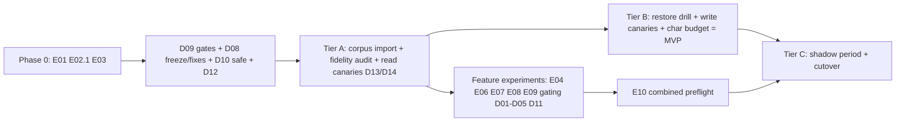

# Straylight MVP Plan

Status: Authoritative plan of record — adopted by owner decision 2026-07-27
Date: 2026-07-28
Owner: Rourke (Tor Kallon)
Vault decision record: `Projects/Straylight/MVP plan and authoritative next steps - 2026-07-27`
Detailed designs and experiment specs: `docs/mvp/` (this document indexes them and holds state)

This document is the single place that holds plan state. Each design (Dxx) and
experiment (Exx) doc carries its own `Status:` line; when one changes, update
the state table here and append to the change log at the bottom. Do not fork
planning state into other documents.

## What the MVP is

**MVP = Tier B of [D14](mvp/D14-migration-and-authority-tiers.md): Straylight
is the daily read/write workspace for Claude Code, Codex, and OpenClaw, holding
the real owner corpus on the simplified core, with the Markdown vault retained
as fallback authority.** Tier C (sole authority) is the post-MVP milestone and
is calendar-gated by a shadow period, not build effort.

"Stronger than MD files" has an explicit endgame definition, tested by
[E10](mvp/E10-combined-preflight.md): corpus-wide non-inferiority to
files-with-writable-sidecar on every suite, a statistically resolved win
(n≥3 paired draws, McNemar) on at least one suite, plus the files-impossible
capabilities (cross-agent visibility, credentials, remote binaries, resume
deltas) proven in real use.

## Where things stand (evidence, 2026-07-28)

- Simplified core v8 (`c3a5420`) passes the 640K-record exact+lexical soak:
  open p95 59.7ms, search 53.1ms, checkpoint 17.1ms at 11 rows, with no
  latency drift from change-log growth. E03 Mode 1 independently passed its
  exact+lexical gates. Its fully indexed semantic-ready Mode 2 normally had
  low percentiles but failed the blocking zero-deferred-lane gate on four
  timeout-shaped observations, so paid Mode 3 was aborted.
- E02 Stage 1 confirmed the verbatim loss at 0/30 across 1K, 10K, and 64K.
  The D02 flag-on arm recovered only the four byte-2,600 probes at each scale
  and lost every deeper identifier. D02 remains default-off pending repair;
  the 640K soak and reasoning draws were aborted.
- E07 completed all 162 frozen sessions. The D04 mechanism cleared its
  predeclared net-win, safety, deterministic, and context gates, but the effect
  estimate remained imprecise and unprompted supersession authoring failed at
  7/18. D04 remains default-off and is not Tier-C ready; assisted authoring and
  a fresh adoption qualification are required.
- E08 stopped at deterministic preflight without a feature verdict. Its
  flag-on calibration recorded complete canonical query counts but failed the
  nonintentional 64K concurrent-search p95 gate at 874.535 ms against the
  750.0 ms ceiling. No query-budget contract, latency contrast, or reasoning
  draw ran; D05 remains default-off and any rerun needs a prospectively
  approved amended protocol.
- Downstream E04–E08 runs therefore freeze `verbatim_spans=off`; none can
  rehabilitate D02. E09 is prerequisite-aborted by E03's failed Mode 2 and
  missing quality backfill. E10 lacks an accepted immutable launch flag
  manifest: E01 is complete, E04 rejected both D01 configurations, E05
  rejected `lexical_single_scan`, and E06 rejected D03; E07's adoption failure,
  E08's absent feature verdict, and E09's prerequisite abort still prevent the
  launch feature set from being frozen. E11 is
  prerequisite-aborted by D02's rejection, the absent D06/`link_leads`
  implementation, and the missing owner-authored, owner-signed-off case
  manifest.
- E01's n=3 paired baseline did not establish service non-inferiority or
  suite-level superiority. It also found materially fewer model-visible
  RuptureOps characters in service than filesystem, so the earlier
  service-over-files overfetch diagnosis is not supported by the paired
  baseline. E04 then showed that neither tested D01 candidate produced the
  required 25% reduction or acceptable chronic-case tradeoff.
- Zero of the six launch gates are complete. No client has exercised the MCP
  surface against the simplified core (all 2026-07-24 MCP results were
  legacy-core). No deployment holds owner data on the new core: hosted runs
  legacy; Nyx has the simplified schema with intentionally empty tables.
- The critical path to first use is the owner-corpus import to Nyx (gate 3),
  not the hosted cutover.

## Operating rules (unchanged, restated)

1. All reasoning evaluation runs use the ChatGPT-authenticated Codex
   subscription, fail-closed. Usage-billed OpenAI is allowed only for
   embeddings (recorded exemption in `Decisions.md`).
2. Every experiment requires a preflight dollar estimate, a hard ceiling, and
   abort criteria — for all tiers, not just launch experiments.
3. Every context-shaping change ships behind a runtime kill switch and is gated
   by an n≥3 paired-draw experiment. Single-draw acceptance is a defect.
4. Markdown-authority round-trip: any new durable metadata is authored or
   representable in Markdown and survives rebuild-from-vault.
5. Dreaming stays paused (Open question 8). No schema expansion, no validity
   intervals, no graph database, no restored synchronous global consistency.

## State table

Phase 0 — measurement, pre-code (no product code changes; harness/corpus only):

| ID | Title | Status | Gates / feeds |
|---|---|---|---|
| [E01](mvp/E01-paired-draw-machinery-and-baseline.md) | Paired-draw machinery, writable-sidecar control, baseline measurement | Complete — non-inferiority not established; paired overfetch absent | Feeds every Exx; does not support service-versus-files overfetch |
| [E02](mvp/E02-verbatim-identifier-gate.md) | Verbatim identifier gate | Stage 1 defect confirmed; Stage 2 flag-on failed 4/30 at every scale; soak and reasoning aborted | D02 rejected; repair and rerun deterministic arm |
| [E03](mvp/E03-semantic-ready-latency-profile.md) | Semantic-ready latency profile (3 modes) | Mode 1 passed; semantic-ready Mode 2 failed zero-deferred-lane gate; paid Mode 3 aborted | Fix semantic timeout path before E09 |

Infrastructure — no reasoning-quality risk (code, no experiment gate):

| ID | Title | Status | Notes |
|---|---|---|---|
| [D09](mvp/D09-latency-contract-and-gates.md) | Latency contract: timings_ms, regression-tier gates, per-op query budgets, EXPLAIN assertions | Implemented in harness — isolated acceptance runs remain | Enabler for E03 mode 3; query budgets become measured only after the coordinated run |
| [D08](mvp/D08-legacy-freeze-and-deletion.md) | Legacy freeze now; deletion later (needs gates 3–4 AND n≥3 parity); dream-retry fix now; MCP residue removal now | Proposed — not started | Dream-retry fix and MCP residue are immediate |
| [D10](mvp/D10-read-path-roundtrip-reductions.md) | Read-path round-trip reductions (safe subset) | Proposed — safe subset not started | Deferred lexical consolidation rejected by [E05](mvp/E05-lexical-consolidation-guard.md) and closed |
| [D12](mvp/D12-operational-simplification.md) | S3-only, single hosted target, Datadog trim, backfill rate limit | Backfill guard implemented — remaining operational work not started | Kills the MinIO CVE release blocker |

Features — flag + experiment gated:

| ID | Title | Status | Gated by |
|---|---|---|---|
| [D01](mvp/D01-budget-contracted-retrieval.md) | Budget-contracted retrieval + result budgets (overfetch fix; top-1 complete hydration) | Implemented default-off, rejected by E04 | Closed; retain baseline A |
| [E04](mvp/E04-result-budget-experiment.md) | Result-budget experiment | Complete negative — B and C rejected; retain A | Gates D01 |
| [D02](mvp/D02-verbatim-span-contract.md) | Verbatim-span contract | Implemented default-off, rejected by E02 Stage 2 | Repair, then rerun [E02](mvp/E02-verbatim-identifier-gate.md) |
| [D03](mvp/D03-resume-delta-packets.md) | Resume delta packets ("changes since your checkpoint") | Implemented default-off, rejected by E06 | Closed; keep `resume_deltas` off |
| [E06](mvp/E06-resume-delta-experiment.md) | Resume delta experiment | Complete negative — no case win or paired claim improvement; payload larger in 15/15 pairs | D03 rejected |
| [D04](mvp/D04-supersession-current-truth.md) | Supersession / current-truth (Markdown frontmatter round-trip) | Implemented default-off — E07 mechanism passed, adoption failed; not Tier-C ready | Add assisted authoring and requalify adoption |
| [E07](mvp/E07-supersession-experiment.md) | Supersession demotion and adoption | Complete split result — mechanism passed frozen gate; adoption failed 7/18 | D04 remains default-off pending assisted authoring |
| [D05](mvp/D05-intention-ledger.md) | Intention ledger at open | Implemented default-off — E08 deterministic preflight stopped; no feature verdict | Prospectively approve an amended [E08](mvp/E08-intention-ledger-experiment.md) protocol before rerun |
| [E08](mvp/E08-intention-ledger-experiment.md) | Intention ledger experiment | Stopped at deterministic preflight — concurrent-search p95 874.535ms > 750ms; no feature verdict | No contract or reasoning ran; D05 remains default-off |
| [D11](mvp/D11-semantic-lane-policy.md) | Semantic lane policy: existence question, embed cache + deadline | Implemented behind default-off flags — E09 prerequisite-aborted | Repair E03 Mode 2 and complete quality backfill before [E09](mvp/E09-semantic-existence-experiment.md) |

Readiness — clients, migration, authority:

| ID | Title | Status | Notes |
|---|---|---|---|
| [D13](mvp/D13-client-integration-and-canaries.md) | Client integration + canaries: Codex, OpenClaw, Claude Code; token runbook | Proposed — not started | Claude Code ~1 focused day |
| [D14](mvp/D14-migration-and-authority-tiers.md) | Migration and authority tiers A/B/C; fidelity audit; shadow protocol with abort tripwires | Proposed — not started | Defines the MVP boundary |

Conditional — do not start until stated preconditions hold:

| ID | Title | Status | Precondition |
|---|---|---|---|
| [D06](mvp/D06-wiki-link-leads.md) | Wiki-link neighbor leads | Conditional — not implemented; E11 prerequisite-aborted | D01+D02 accepted; owner corpus imported; owner-authored and signed-off case manifest |
| [D07](mvp/D07-lesson-artifacts.md) | Lesson artifacts, role-scoped | Conditional | D01–D04 landed |
| [E05](mvp/E05-lexical-consolidation-guard.md) | Lexical consolidation guard | Complete negative — zero SQL reduction in 795 paired search samples; treatment rejected | Deferred D10 item closed |
| [E10](mvp/E10-combined-preflight.md) | Combined all-flags-on preflight | Prerequisite abort — accepted immutable launch manifest not qualified | Resolve D04 adoption, E08/D05, and E09; exclude rejected flags; then freeze the manifest |

## Sequencing

Phase 0 and Tier A can start immediately and in parallel: Phase 0 experiments
touch only the harness; Tier A touches only deployment and data. Feature work
(D01–D05, D11) begins only after E01 re-establishes the baseline it targets.

## Immediate next steps

1. Preserve E01's completed paired-draw baseline. E02 and E03 have definitive
   failures: repair D02 and the semantic timeout path, then rerun their free
   deterministic prerequisites before any paid or reasoning arms. Keep D05
   default-off; do not rerun E08 until an amended protocol is prospectively
   approved.
2. Ship the immediate D08 items: dream-retry permanent-failure fix, MCP legacy
   residue removal, legacy cargo-feature freeze.
3. Run D09's isolated 64K/640K acceptance and calibrate the fail-closed
   code-shape query budgets only if the recorded counts prove an adjustment is
   necessary.
4. Execute Tier A per D14: tag/retain v8, export→import owner corpus to Nyx,
   fidelity audit, read-only tokens, three-client read canaries per D13.
5. Then Tier B per D14 — that is the MVP.

## Change log

- 2026-07-28: Re-audited E10 after E06–E08. E04/D01 and E06/D03
  are now resolved drops, but E07's failed adoption gate, E08's absent feature
  verdict, E09's prerequisite abort, and the absent accepted immutable launch
  manifest still block E10. The Tier-C gate remains closed.
- 2026-07-28: E07 completed all 162 frozen sessions. Its mechanism gate passed
  at 6 flag wins / 2 baseline wins / 4 ties (net +4), with a wide clustered
  95% interval of [-2.333, 3.667] and collapsed McNemar p=1.0. Unprompted
  supersession adoption failed at 7/18, so D04 remains default-off and requires
  assisted authoring before a new adoption qualification.
- 2026-07-28: E08 stopped at deterministic preflight with no D05 feature
  verdict. Its exact flag-on calibration recorded complete canonical query
  counts but failed concurrent-search p95 at 874.535 ms against the 750.0 ms
  gate. No query-budget contract, latency contrast, reasoning case-run, draw,
  audit, aggregate, embedding request, or billable inference ran. D05 remains
  default-off; a rerun requires a prospectively approved amended protocol.
- 2026-07-28: E06 completed 45/45 reasoning case-runs with zero timeout/error.
  D03 passed its deterministic 640K mechanism gates (77.606 ms resume p95,
  exact +5 SQL statements in 30/30 pairs, exact lineage in 30/30) but failed
  the product gates. B produced 0/5 cases in all three draws, claim-level
  one-sided McNemar p=0.8125 versus A and p=0.96875 versus C, and increased
  operation-level resume characters in all 15/15 pairs (+63,387 total).
  D03 is rejected and `resume_deltas` remains off. Actual API/embedding spend
  was $0.
- 2026-07-28: E04 completed 528/528 case-runs with zero timeout/error.
  Both candidates passed deterministic 640K and query-count gates, but neither
  passed reasoning acceptance. C had no significant RuptureOps claim gain and
  reduced service-result characters by only 6.8% versus the required 25%;
  B reduced them by 1.3%. Both failed the chronic rule. D01 is rejected for
  rollout and all three flags remain off. Actual API/embedding spend was $0.
- 2026-07-28: E01 completed 531 untouched definitive case-runs at three
  paired draws. Service-versus-sidecar non-inferiority was not established
  (-4.667 claims, 95% CI [-13.667, 4.333], lower bound below the -5 margin).
  RuptureOps paired service-versus-files overfetch was absent: service minus
  files was -79,549 model-visible characters/case, 95% CI
  [-111,508, -49,126]. Actual API/embedding spend was $0.
- 2026-07-28: At the `d989ae5` evidence snapshot, froze the rejected D02
  nuisance posture off for E04–E08 and recorded prerequisite aborts for E09,
  E10, and E11. Later outcomes do not rewrite those snapshot artifacts; the
  current E10 blocker audit is recorded separately. No E09–E11 service,
  reasoning, or embedding run occurred.
- 2026-07-28: E05 completed negative. Both 640K soaks passed, but all 795
  paired search query-count deltas were zero, so the strict-improvement gate
  blocked reasoning. `lexical_single_scan` is rejected and the deferred D10
  item is closed.
- 2026-07-28: E02 Stage 1 confirmed the 0/30 defect. Stage 2 flag-on
  returned only 4/30 at 1K, 10K, and 64K, so the 640K soak and reasoning
  draws were aborted and D02 remains default-off pending repair. E03 Mode 1
  passed, but fully indexed Mode 2 failed its zero-deferred-lane gate; paid
  Mode 3 was aborted.
- 2026-07-27: D09 implementation landed in the harness: request-scoped SQL
  counting, 64K/640K regression tiers, checked query budgets, and
  migration/database-fingerprinted EXPLAIN assertions. Isolated-stack
  acceptance and measured budget confirmation remain.
- 2026-07-27: Plan created and adopted as authoritative. All items Proposed /
  Specified; nothing started.
