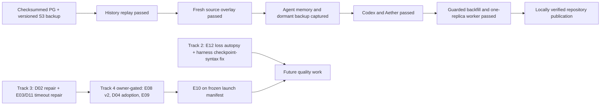

# Brunn MVP Plan

Status: Authoritative plan of record — direct Railway owner cutover and repository publication complete
Date: 2026-07-31
Owner: Rourke (Tor Kallon)
Prior decision record: `Projects/Brunn/MVP plan and authoritative next steps - 2026-07-27` (captured in the migration source; no longer a write target)
Detailed designs and experiment specs: `docs/mvp/` (this document indexes them and holds state)

This document is the single place that holds plan state. Each design (Dxx) and
experiment (Exx) doc carries its own `Status:` line; when one changes, update
the state table here and append to the change log at the bottom. Do not fork
planning state into other documents.

## What the MVP is

**MVP = the Railway simplified service is the sole durable memory workspace for
Codex and Aether/OpenClaw, holding the complete owner corpus and current local
agent memory.** Nyx remains the operator and test host, not a pilot. The owner
explicitly superseded the earlier Tier A/Tier B rollout and Markdown-authority
shadow period on 2026-07-31. After cutover, clients must neither read from nor
write durable memory to the vault.

"Stronger than MD files" has an explicit endgame definition, tested by
[E10](mvp/E10-combined-preflight.md): corpus-wide non-inferiority to
files-with-writable-sidecar on every suite, a statistically resolved win
(n≥3 paired draws, McNemar) on at least one suite, plus the files-impossible
capabilities (cross-agent visibility, credentials, remote binaries, resume
deltas) proven in real use.

## Where things stand (evidence, 2026-07-31)

- Railway is serving the simplified API at build
  `39761166d21b0cfa44d11e3ba18a52112693d0cd`. Health and readiness pass, all
  56 migrations are applied, the 600/minute request limit is restored,
  legacy/evaluation APIs are disabled, all three disabled probes return 404,
  context-shaping treatments and dreaming are off, and operational cache,
  backfill guard, and timing instrumentation are on. Web deployment
  `316d90eb-d807-4091-84d4-8ba10b49a2f2` passes at that build. Temporary
  two-replica finalizer `0792432f` succeeded; permanent worker deployment
  `7af78da7-3b01-4a66-9923-3aa8184d1978` is `SUCCESS` with exactly one replica
  and prior deployments removed.
- The least-loss layered migration is complete. The production audit matched
  4,926 legacy paths, 4,955 legacy versions, 5,079 native records, and 10,038
  remote history versions. The 20,047-copy, 797,775,263-byte round trip had
  zero differences.
- The exact 4,267-file source overlay passed import and all-skip replay. Its
  disjoint delta was 4,173 exact unchanged, 12 metadata-only changes, 21
  content changes, 61 additions, and 10 absent/moved paths. All ten were
  soft-deleted with history retained and replacements active; the source
  fingerprint remains unchanged on re-audit.
- Current agent memory (398 files) and an additional dormant Aether backup
  corpus (2,793 files, including 2,386 not byte-identical to prior captures)
  are imported and replay-verified. The old live sources are absent or archived.
- Before worker processing, the service held 13,702 active entries, 13,831
  history versions, and 12,727 queued jobs. Backfill is complete at zero queued,
  running, or failed; 126,536 search chunks have zero missing embeddings.
  Current counts are 13,709 active entries, ten deleted current paths retained
  in history, and 13,838 history versions.
- Railway Pro is active and its confirmed $20/month minimum is infrastructure
  spend, not embedding spend. The database volume was live-resized from 5 GB to
  20 GB and the checked-in topology declares 20,000 MB. The final filesystem is
  25% used with 13.6 GiB free.
- Reasoning and canary inference used the ChatGPT-authenticated Codex plan;
  archival descriptions used zero inference API calls. Actual embedding billing
  is unavailable, but the absolute upper bound remains $3.61, below the $20
  warning threshold.
- A checksummed PostgreSQL backup and the versioned external S3 source are
  retained. Catalog validation passed. An isolated restore attempt could not
  start because locked Nyx prevented Docker access; no container was created.
  This is recorded as an environment-blocked, non-blocking exception for the
  direct owner cutover. The aggregate record is
  [`results/2026-07-31-railway-simplified-cutover.md`](../results/2026-07-31-railway-simplified-cutover.md).
- Both clients use separate credentials and pinned wrappers and are configured
  Brunn-only. Codex passed open/read/write/replay/checkpoint and stale-409
  canaries. Aether/OpenClaw's strict post-archive rerun passed cross-read,
  byte-identical path/ref replay, checkpoint/resume, no-delivery, and
  no-API-key reasoning through its healthy normal gateway.
- The noisy scheduled Dependabot configuration was removed and its 21 open
  pull requests were closed. Hosted CI remains disabled because GitHub rejects
  every job before execution for account billing/spending-limit reasons; it is
  not a publication gate and must not be re-enabled until billing is repaired.
- Fresh one-replica qualification passed 30 opens and 30 exact searches with
  zero failures: service p95 was 31.809529 ms open and 29.295206 ms search,
  below the 120 ms and 107 ms limits. Final source re-audit is unchanged.

Historical experiment conclusions remain unchanged:

- Simplified core v8 (`c3a5420`) passes the 640K-record exact+lexical soak:
  open p95 59.7ms, search 53.1ms, checkpoint 17.1ms at 11 rows, with no
  latency drift from change-log growth. E03 Mode 1 independently passed its
  exact+lexical gates. Its fully indexed semantic-ready Mode 2 normally had
  low percentiles but failed the blocking zero-deferred-lane gate on four
  timeout-shaped observations, so paid Mode 3 was aborted.
- E02 Stage 1 confirmed the verbatim loss at 0/30 across 1K, 10K, and 64K.
  The D02 flag-on arm recovered only the four byte-2,600 probes at each scale
  and lost every deeper identifier. D02 remains default-off pending repair;
  the 640K soak and reasoning draws were aborted.
- E07 completed all 162 frozen sessions. The D04 mechanism cleared its
  predeclared net-win, safety, deterministic, and context gates, but the effect
  estimate remained imprecise and unprompted supersession authoring failed at
  7/18. D04 remains default-off and is not Tier-C ready; assisted authoring and
  a fresh adoption qualification are required.
- E08 stopped at deterministic preflight without a feature verdict. Its
  flag-on calibration recorded complete canonical query counts but failed the
  nonintentional 64K concurrent-search p95 gate at 874.535 ms against the
  750.0 ms ceiling. No query-budget contract, latency contrast, or reasoning
  draw ran; D05 remains default-off and any rerun needs a prospectively
  approved amended protocol.
- Downstream E04–E08 runs therefore freeze `verbatim_spans=off`; none can
  rehabilitate D02. E09 is prerequisite-aborted by E03's failed Mode 2 and
  missing quality backfill. E10 lacks an accepted immutable launch flag
  manifest: E01 is complete, E04 rejected both D01 configurations, E05
  rejected `lexical_single_scan`, and E06 rejected D03; E07's adoption failure,
  E08's absent feature verdict, and E09's prerequisite abort still prevent the
  launch feature set from being frozen. E11 is
  prerequisite-aborted by D02's rejection, the absent D06/`link_leads`
  implementation, and the missing owner-authored, owner-signed-off case
  manifest.
- E01's n=3 paired baseline did not establish service non-inferiority or
  suite-level superiority. It also found materially fewer model-visible
  RuptureOps characters in service than filesystem, so the earlier
  service-over-files overfetch diagnosis is not supported by the paired
  baseline. E04 then showed that neither tested D01 candidate produced the
  required 25% reduction or acceptable chronic-case tradeoff.
- The 2026-07-24 MCP results remain legacy-core evidence and do not satisfy the
  current simplified-service client canaries.

## Operating rules (unchanged, restated)

1. All reasoning evaluation runs use the ChatGPT-authenticated Codex
   subscription, fail-closed. Usage-billed OpenAI is allowed only for
   embeddings (recorded exemption in `Decisions.md`).
2. Every experiment requires a preflight dollar estimate, a hard ceiling, and
   abort criteria — for all tiers, not just launch experiments.
3. Every context-shaping change ships behind a runtime kill switch and is gated
   by an n≥3 paired-draw experiment. Single-draw acceptance is a defect.
4. Brunn is the post-cutover durable authority. Preserve the exact fresh
   source capture and export evidence for recovery, but do not continue a
   second writable Markdown authority.
5. Dreaming stays paused (Open question 8). No schema expansion, no validity
   intervals, no graph database, no restored synchronous global consistency.

## State table

Phase 0 — measurement, pre-code (no product code changes; harness/corpus only):

| ID | Title | Status | Gates / feeds |
|---|---|---|---|
| [E01](mvp/E01-paired-draw-machinery-and-baseline.md) | Paired-draw machinery, writable-sidecar control, baseline measurement | Complete — non-inferiority not established; paired overfetch absent | Feeds every Exx; does not support service-versus-files overfetch |
| [E02](mvp/E02-verbatim-identifier-gate.md) | Verbatim identifier gate | Stage 1 defect confirmed; Stage 2 flag-on failed 4/30 at every scale; soak and reasoning aborted | D02 rejected; repair and rerun deterministic arm |
| [E03](mvp/E03-semantic-ready-latency-profile.md) | Semantic-ready latency profile (3 modes) | Mode 1 passed; semantic-ready Mode 2 failed zero-deferred-lane gate; paid Mode 3 aborted | Fix semantic timeout path before E09 |
| [E12](mvp/E12-e01-loss-autopsy.md) | E01 loss autopsy — dual-rater taxonomy over 531 saved case-runs, $0 API | Specified — not run | Prerequisite to any new context-shaping design; not a cutover blocker under the 2026-07-31 owner decision |

Infrastructure — no reasoning-quality risk (code, no experiment gate):

| ID | Title | Status | Notes |
|---|---|---|---|
| [D09](mvp/D09-latency-contract-and-gates.md) | Latency contract: timings_ms, regression-tier gates, per-op query budgets, EXPLAIN assertions | Implemented in harness — isolated acceptance runs remain | Enabler for E03 mode 3; query budgets become measured only after the coordinated run |
| [D08](mvp/D08-legacy-freeze-and-deletion.md) | Legacy freeze and eventual deletion | Simplified production route and import proof pass; destructive legacy-code deletion remains a future restore-backed change | The environment-blocked drill does not block this direct cutover, but recovery tooling remains |
| [D10](mvp/D10-read-path-roundtrip-reductions.md) | Read-path round-trip reductions (safe subset) | Proposed — safe subset not started | Deferred lexical consolidation rejected by [E05](mvp/E05-lexical-consolidation-guard.md) and closed |
| [D12](mvp/D12-operational-simplification.md) | S3-only, single hosted target, Datadog trim, backfill rate limit | Railway/import/web/client/backfill/worker/publication gates passed; restore exception recorded | Railway is the only production target |
| [D15](mvp/D15-agent-first-tasks.md) | Agent-first tasks | Implemented — release requires all owner-approved gates 1–12 | Deterministic bounded surfaces; gates 1–12 required before release |
| [D16](mvp/D16-agent-messaging.md) | Agent messaging | Production services live — source `21bd90f` gate-on; Gate 12g pending | MCP→Echo→Web and zero-5xx observation green; signed install-ready iOS build blocked by the locked login keychain |

Features — flag + experiment gated:

| ID | Title | Status | Gated by |
|---|---|---|---|
| [D01](mvp/D01-budget-contracted-retrieval.md) | Budget-contracted retrieval + result budgets (overfetch fix; top-1 complete hydration) | Implemented default-off, rejected by E04 | Closed; retain baseline A |
| [E04](mvp/E04-result-budget-experiment.md) | Result-budget experiment | Complete negative — B and C rejected; retain A | Gates D01 |
| [D02](mvp/D02-verbatim-span-contract.md) | Verbatim-span contract | Implemented default-off, rejected by E02 Stage 2 | Repair, then rerun [E02](mvp/E02-verbatim-identifier-gate.md) |
| [D03](mvp/D03-resume-delta-packets.md) | Resume delta packets ("changes since your checkpoint") | Implemented default-off, rejected by E06 | Closed; keep `resume_deltas` off |
| [E06](mvp/E06-resume-delta-experiment.md) | Resume delta experiment | Complete negative — no case win or paired claim improvement; payload larger in 15/15 pairs | D03 rejected |
| [D04](mvp/D04-supersession-current-truth.md) | Supersession / current-truth (Markdown frontmatter round-trip) | Implemented default-off — E07 mechanism passed, adoption failed; not Tier-C ready | Add assisted authoring and requalify adoption |
| [E07](mvp/E07-supersession-experiment.md) | Supersession demotion and adoption | Complete split result — mechanism passed frozen gate; adoption failed 7/18 | D04 remains default-off pending assisted authoring |
| [D05](mvp/D05-intention-ledger.md) | Intention ledger at open | Implemented default-off — E08 deterministic preflight stopped; no feature verdict | Prospectively approve an amended [E08](mvp/E08-intention-ledger-experiment.md) protocol before rerun |
| [E08](mvp/E08-intention-ledger-experiment.md) | Intention ledger experiment | Stopped at deterministic preflight — concurrent-search p95 874.535ms > 750ms; no feature verdict | No contract or reasoning ran; D05 remains default-off |
| [D11](mvp/D11-semantic-lane-policy.md) | Semantic lane policy: existence question, embed cache + deadline | Implemented behind default-off flags — E09 prerequisite-aborted | Repair E03 Mode 2 and complete quality backfill before [E09](mvp/E09-semantic-existence-experiment.md) |

Readiness — clients, migration, authority:

| ID | Title | Status | Notes |
|---|---|---|---|
| [D13](mvp/D13-client-integration-and-canaries.md) | Client integration + canaries | Direct-cutover subset passed for Codex and Aether/OpenClaw | Both are configured Brunn-only; broader reusable qualification and Claude Code are deferred |
| [D14](mvp/D14-migration-and-authority-tiers.md) | Lossless migration and authority cutover | Operational cutover and locally verified repository publication passed | Records the environment-blocked restore exception and hosted-CI billing constraint |

Conditional — do not start until stated preconditions hold:

| ID | Title | Status | Precondition |
|---|---|---|---|
| [D06](mvp/D06-wiki-link-leads.md) | Wiki-link neighbor leads | Conditional — not implemented; E11 prerequisite-aborted | D01+D02 accepted; owner corpus imported; owner-authored and signed-off case manifest |
| [D07](mvp/D07-lesson-artifacts.md) | Lesson artifacts, role-scoped | Conditional | D01–D04 landed |
| [E05](mvp/E05-lexical-consolidation-guard.md) | Lexical consolidation guard | Complete negative — zero SQL reduction in 795 paired search samples; treatment rejected | Deferred D10 item closed |
| [E10](mvp/E10-combined-preflight.md) | Combined all-flags-on preflight | Prerequisite abort — accepted immutable launch manifest not qualified | Resolve D04 adoption, E08/D05, and E09; exclude rejected flags; then freeze the manifest |

## Sequencing

The cutover chain is the current critical path. Experiment follow-ups remain
default-off and must not change the deployed retrieval behavior while the
migration is being audited. No new context-shaping design may be proposed
unless E12's finding 2 justifies it.

## Plan of record — direct cutover plus deferred experiment tracks

The E01–E11 program closed under its frozen stop rules on 2026-07-28. The owner
then superseded the staged rollout with the direct-cutover Track 1 on
2026-07-31. Priority order:

**Track 1 — Complete the direct Railway cutover (highest priority).**
1. **Complete:** zero-diff history replay, checkpoint/service audit, and full
   20,047-copy byte round trip.
2. **Complete:** exact fresh-source overlay, all-skip replay, ten
   history-preserving soft deletions, and unchanged-source re-audit.
3. **Complete:** primary agent-memory and dormant Aether backup capture/import/
   replay; separate credentials and pinned client launchers; Codex canary.
4. **Complete:** final Aether/OpenClaw post-backup gateway rerun, final web
   verification, guarded 12,727-job backfill, 20 GB volume resize, and permanent
   one-replica worker qualification. The isolated restore attempt is recorded
   as environment-blocked and non-blocking for this direct owner cutover.
5. **Complete:** evidence commit `dff91a210293483d95c9ea61c7bab865b5a60f49`
   is published on `origin/main` using the completed local verification matrix.
   Hosted CI remains disabled because GitHub rejects
   every job before execution for account billing/spending-limit reasons;
   re-enable it only after that is repaired.

**Track 2 — Free analysis before any new feature work.**
6. Run [E12](mvp/E12-e01-loss-autopsy.md), the E01 loss autopsy: $0 API,
   dual-rater, fixed taxonomy over all 531 saved case-runs. Its triage
   disposition is a prerequisite to new context-shaping work; its finding 2 is
   the only path to any new context-shaping design doc.
7. Fix canonical checkpoint syntax in the integrated harness — the measured
   20-failure/17-session service-arm drag E01 documented.

**Track 3 — Cheap deterministic repairs ($0–1, all behind off-flags).**
8. D02 repair: source verbatim lines from the exact-lane full-document match
   rather than the excerpt window (the flag-on arm only recovered byte-2,600
   probes); rerun E02's deterministic arm (free).
9. D11/E03 repair: implement the bounded semantic deadline as the fix for the
   ~2.5s Mode 2 stalls; rerun Mode 2 (free), then Mode 3 (~$1,
   embeddings-exempt).

**Track 4 — Owner approval required before each item.**
10. E08 rerun under its Amended protocol v2 (paired flag-off attribution
   preflight, interleaved 3× repetitions, contention controls; ~$31
   equivalent).
11. D04 assisted authoring — the write path proposes `supersedes` frontmatter
   on overlap — then a fresh adoption qualification (the E07 cohort wrote
   intention frontmatter unprompted in 13/18 sessions; supersession needs
   prompting at the point of write, not more documentation).
12. E09 after E03 Mode 2 clears (~$80 equivalent).
13. Formal parity is **not purchased now**: establishing non-inferiority at
    the −5 margin needs ~3–4× more draws (~$400 equivalent) against a CI whose
    width is dominated by draw noise. The owner accepted the completed program
    as sufficient for this direct owner cutover; this does not turn the
    underpowered result into a statistical pass. All rejected or unresolved
    context-shaping flags remain off. A future synthetic run still requires an
    explicit owner decision.

## Change log

- 2026-08-27: Deployed D16's gated durable agent mailbox across API, worker,
  MCP, Web, and iOS. Source `21bd90f` completed the serialized flag-off then
  gate-on rollout; gates 1–11 and scenarios 12a–f are green, and the hosted
  MCP→Echo→Web portion of Gate 12g passed and soft-closed. A 10-minute
  dual-surface observation returned exact-revision readiness 21/21 through
  both the Web proxy and direct API edge, with API 5xx 0/21 and Web 5xx 0/116.
  Existing-credential
  grants added `message.read` and `message.write`, preserving every prior
  capability, to Aether/OpenClaw on Nyx RW, Codex owner alpha, Codex on Erebus
  RW, Grok Bot RW, Claude Web/Mobile RW, Owner alpha, and the separate active
  Web UI session principal referenced by live Web identities. No other
  existing credential changed. A dedicated Echo resident credential was
  created separately with exactly those two capabilities. A physical-device
  install was intentionally not performed; the separately required
  development-signed install-ready build remains blocked because the login
  keychain is locked, leaving Gate 12g open. Fresh handler measurements at 50
  conversations and 10,000 messages recorded 27.429 ms p95 send, 5.073 ms p95
  sync, and a 1,208-byte p95 delta.
- 2026-08-27: Added D15 for the owner-approved agent-first tasks feature.
  Selected canonical versioned task entries plus a transactional indexed
  projection after a 2,000-task spike measured 0.295 ms p95 projection reads
  and an index scan without a sequential scan. Recorded schema, deterministic
  engine, provenance, contexts/projects, HTTP/MCP, guard, Todoist v1 pull,
  narrow iOS credentials, Night Signal surfaces, threat model, and all twelve
  acceptance gates. Release remains closed until every gate, including
  scenarios 12a–g, has recorded passing output.
- 2026-07-31 (cutover execution): Completed the zero-diff layered migration,
  exact fresh-source overlay, ten history-preserving soft deletions, primary
  agent-memory and dormant-backup import/replay, Brunn-only Codex and
  Aether/OpenClaw canaries, and final web verification. Recorded the isolated
  restore as `not_performed_environment_blocked` after locked Nyx prevented
  Docker access; this is non-blocking for the direct owner cutover and is not a
  claimed restore pass. Upgraded Railway to Pro, live-resized the volume to
  20 GB, completed all 12,727 queued jobs with zero failures and zero missing
  embeddings, and qualified the permanent one-replica worker at 30 open plus
  30 exact-search samples with zero failures. Operational cutover and repository
  publication are complete, while hosted CI stays disabled pending repair of
  GitHub Actions billing.
- 2026-07-31 (owner-directed supersession): Replaced the Nyx read-only pilot,
  two-step Tier B progression, and Markdown-authority shadow period with one
  direct Railway production cutover for Codex and Aether/OpenClaw. Selected the
  least-loss layered migration: verified history/native replay, exact fresh
  source overlay, history-preserving soft deletions, then local agent-memory
  capture. Completion requires zero-diff production audits, client read/write
  canaries, Brunn-only persistence proof, an explicit recovery-evidence
  disposition, and locally verified repository publication. Hosted CI can be
  re-enabled only after GitHub Actions billing is repaired. Historical E01–E11 results and
  default-off decisions are unchanged.
- 2026-07-28 (plan revision, owner-adopted): Replaced "Immediate next steps"
  with the four-track plan of record. Withdrew the Tier B char-budget entry
  condition (overfetch premise falsified by E01's paired baseline: service
  32,067 chars/case vs files 101,406) in favor of D09-regression-green + E12
  triage. Added E12 (E01 loss autopsy, $0 API, dual-rater). Amended E10's
  superiority rule with a claim-CI route for <10-case suites (McNemar is
  mechanically unreachable on the 5-case transitions suite). Recorded E08
  Amended protocol v2 (paired flag-off attribution preflight) pending owner
  approval. Deferred the formal parity purchase (~$400 equivalent for 3–4×
  draws) to Tier C entry, satisfiable by shadow-period real-work evidence.
- 2026-07-28: Re-audited E10 after E06–E08. E04/D01 and E06/D03
  are now resolved drops, but E07's failed adoption gate, E08's absent feature
  verdict, E09's prerequisite abort, and the absent accepted immutable launch
  manifest still block E10. The Tier-C gate remains closed.
- 2026-07-28: E07 completed all 162 frozen sessions. Its mechanism gate passed
  at 6 flag wins / 2 baseline wins / 4 ties (net +4), with a wide clustered
  95% interval of [-2.333, 3.667] and collapsed McNemar p=1.0. Unprompted
  supersession adoption failed at 7/18, so D04 remains default-off and requires
  assisted authoring before a new adoption qualification.
- 2026-07-28: E08 stopped at deterministic preflight with no D05 feature
  verdict. Its exact flag-on calibration recorded complete canonical query
  counts but failed concurrent-search p95 at 874.535 ms against the 750.0 ms
  gate. No query-budget contract, latency contrast, reasoning case-run, draw,
  audit, aggregate, embedding request, or billable inference ran. D05 remains
  default-off; a rerun requires a prospectively approved amended protocol.
- 2026-07-28: E06 completed 45/45 reasoning case-runs with zero timeout/error.
  D03 passed its deterministic 640K mechanism gates (77.606 ms resume p95,
  exact +5 SQL statements in 30/30 pairs, exact lineage in 30/30) but failed
  the product gates. B produced 0/5 cases in all three draws, claim-level
  one-sided McNemar p=0.8125 versus A and p=0.96875 versus C, and increased
  operation-level resume characters in all 15/15 pairs (+63,387 total).
  D03 is rejected and `resume_deltas` remains off. Actual API/embedding spend
  was $0.
- 2026-07-28: E04 completed 528/528 case-runs with zero timeout/error.
  Both candidates passed deterministic 640K and query-count gates, but neither
  passed reasoning acceptance. C had no significant RuptureOps claim gain and
  reduced service-result characters by only 6.8% versus the required 25%;
  B reduced them by 1.3%. Both failed the chronic rule. D01 is rejected for
  rollout and all three flags remain off. Actual API/embedding spend was $0.
- 2026-07-28: E01 completed 531 untouched definitive case-runs at three
  paired draws. Service-versus-sidecar non-inferiority was not established
  (-4.667 claims, 95% CI [-13.667, 4.333], lower bound below the -5 margin).
  RuptureOps paired service-versus-files overfetch was absent: service minus
  files was -79,549 model-visible characters/case, 95% CI
  [-111,508, -49,126]. Actual API/embedding spend was $0.
- 2026-07-28: At the `d989ae5` evidence snapshot, froze the rejected D02
  nuisance posture off for E04–E08 and recorded prerequisite aborts for E09,
  E10, and E11. Later outcomes do not rewrite those snapshot artifacts; the
  current E10 blocker audit is recorded separately. No E09–E11 service,
  reasoning, or embedding run occurred.
- 2026-07-28: E05 completed negative. Both 640K soaks passed, but all 795
  paired search query-count deltas were zero, so the strict-improvement gate
  blocked reasoning. `lexical_single_scan` is rejected and the deferred D10
  item is closed.
- 2026-07-28: E02 Stage 1 confirmed the 0/30 defect. Stage 2 flag-on
  returned only 4/30 at 1K, 10K, and 64K, so the 640K soak and reasoning
  draws were aborted and D02 remains default-off pending repair. E03 Mode 1
  passed, but fully indexed Mode 2 failed its zero-deferred-lane gate; paid
  Mode 3 was aborted.
- 2026-07-27: D09 implementation landed in the harness: request-scoped SQL
  counting, 64K/640K regression tiers, checked query budgets, and
  migration/database-fingerprinted EXPLAIN assertions. Isolated-stack
  acceptance and measured budget confirmation remain.
- 2026-07-27: Plan created and adopted as authoritative. All items Proposed /
  Specified; nothing started.
