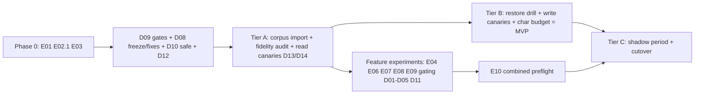

# Straylight MVP Plan

Status: Authoritative plan of record — adopted by owner decision 2026-07-27
Date: 2026-07-27
Owner: Rourke (Tor Kallon)
Vault decision record: `Projects/Straylight/MVP plan and authoritative next steps - 2026-07-27`
Detailed designs and experiment specs: `docs/mvp/` (this document indexes them and holds state)

This document is the single place that holds plan state. Each design (Dxx) and
experiment (Exx) doc carries its own `Status:` line; when one changes, update
the state table here and append to the change log at the bottom. Do not fork
planning state into other documents.

## What the MVP is

**MVP = Tier B of [D14](mvp/D14-migration-and-authority-tiers.md): Straylight
is the daily read/write workspace for Claude Code, Codex, and OpenClaw, holding
the real owner corpus on the simplified core, with the Markdown vault retained
as fallback authority.** Tier C (sole authority) is the post-MVP milestone and
is calendar-gated by a shadow period, not build effort.

"Stronger than MD files" has an explicit endgame definition, tested by
[E10](mvp/E10-combined-preflight.md): corpus-wide non-inferiority to
files-with-writable-sidecar on every suite, a statistically resolved win
(n≥3 paired draws, McNemar) on at least one suite, plus the files-impossible
capabilities (cross-agent visibility, credentials, remote binaries, resume
deltas) proven in real use.

## Where things stand (evidence, 2026-07-27)

- Simplified core v8 (`c3a5420`) passes the 640K-record soak: open p95 59.7ms,
  search 53.1ms, checkpoint 17.1ms at 11 rows, no latency drift with change-log
  growth. All latency evidence is exact+lexical with embeddings pending; no
  semantic-ready profile exists.
- Reasoning is at parity-within-noise vs direct Markdown but unproven (n=1;
  single-draw suite scores swing ±3–5 claims). The native API on the simplified
  core scored 186/228 vs files 194/228; 21/22 disputed answers had the right
  source in returned context — losses are context compilation, not retrieval.
- RuptureOps overfetch (~70,814 vs 41,441 service chars/case) is the leading
  quality risk. Chronic cases are enumerated in
  [E04](mvp/E04-result-budget-experiment.md).
- Zero of the six launch gates are complete. No client has exercised the MCP
  surface against the simplified core (all 2026-07-24 MCP results were
  legacy-core). No deployment holds owner data on the new core: hosted runs
  legacy; Nyx has the simplified schema with intentionally empty tables.
- The critical path to first use is the owner-corpus import to Nyx (gate 3),
  not the hosted cutover.

## Operating rules (unchanged, restated)

1. All reasoning evaluation runs use the ChatGPT-authenticated Codex
   subscription, fail-closed. Usage-billed OpenAI is allowed only for
   embeddings (recorded exemption in `Decisions.md`).
2. Every experiment requires a preflight dollar estimate, a hard ceiling, and
   abort criteria — for all tiers, not just launch experiments.
3. Every context-shaping change ships behind a runtime kill switch and is gated
   by an n≥3 paired-draw experiment. Single-draw acceptance is a defect.
4. Markdown-authority round-trip: any new durable metadata is authored or
   representable in Markdown and survives rebuild-from-vault.
5. Dreaming stays paused (Open question 8). No schema expansion, no validity
   intervals, no graph database, no restored synchronous global consistency.

## State table

Phase 0 — measurement, pre-code (no product code changes; harness/corpus only):

| ID | Title | Status | Gates / feeds |
|---|---|---|---|
| [E01](mvp/E01-paired-draw-machinery-and-baseline.md) | Paired-draw machinery, writable-sidecar control, baseline replication | Specified — not run | Feeds every Exx; re-establishes the overfetch diagnosis |
| [E02](mvp/E02-verbatim-identifier-gate.md) (stage 1) | Verbatim identifier gate — expected-fail proof on current build | Specified — not run | Gates D02 |
| [E03](mvp/E03-semantic-ready-latency-profile.md) | Semantic-ready latency profile (3 modes) | Specified — not run | Feeds E09, D11; mode 3 wants D09 timings |

Infrastructure — no reasoning-quality risk (code, no experiment gate):

| ID | Title | Status | Notes |
|---|---|---|---|
| [D09](mvp/D09-latency-contract-and-gates.md) | Latency contract: timings_ms, regression-tier gates, per-op query budgets, EXPLAIN assertions | Implemented in harness — isolated acceptance runs remain | Enabler for E03 mode 3; query budgets become measured only after the coordinated run |
| [D08](mvp/D08-legacy-freeze-and-deletion.md) | Legacy freeze now; deletion later (needs gates 3–4 AND n≥3 parity); dream-retry fix now; MCP residue removal now | Proposed — not started | Dream-retry fix and MCP residue are immediate |
| [D10](mvp/D10-read-path-roundtrip-reductions.md) | Read-path round-trip reductions (safe subset) | Proposed — not started | Deferred lexical consolidation needs [E05](mvp/E05-lexical-consolidation-guard.md) |
| [D12](mvp/D12-operational-simplification.md) | S3-only, single hosted target, Datadog trim, backfill rate limit | Proposed — not started | Kills the MinIO CVE release blocker |

Features — flag + experiment gated:

| ID | Title | Status | Gated by |
|---|---|---|---|
| [D01](mvp/D01-budget-contracted-retrieval.md) | Budget-contracted retrieval + result budgets (overfetch fix; top-1 complete hydration) | Proposed — not started | [E04](mvp/E04-result-budget-experiment.md) |
| [D02](mvp/D02-verbatim-span-contract.md) | Verbatim-span contract | Proposed — not started | [E02](mvp/E02-verbatim-identifier-gate.md) |
| [D03](mvp/D03-resume-delta-packets.md) | Resume delta packets ("changes since your checkpoint") | Proposed — not started | [E06](mvp/E06-resume-delta-experiment.md) |
| [D04](mvp/D04-supersession-current-truth.md) | Supersession / current-truth (Markdown frontmatter round-trip) | Proposed — not started | [E07](mvp/E07-supersession-experiment.md) |
| [D05](mvp/D05-intention-ledger.md) | Intention ledger at open | Proposed — not started | [E08](mvp/E08-intention-ledger-experiment.md) |
| [D11](mvp/D11-semantic-lane-policy.md) | Semantic lane policy: existence question, embed cache + deadline | Proposed — not started | [E09](mvp/E09-semantic-existence-experiment.md) — may conclude "cut the lane" |

Readiness — clients, migration, authority:

| ID | Title | Status | Notes |
|---|---|---|---|
| [D13](mvp/D13-client-integration-and-canaries.md) | Client integration + canaries: Codex, OpenClaw, Claude Code; token runbook | Proposed — not started | Claude Code ~1 focused day |
| [D14](mvp/D14-migration-and-authority-tiers.md) | Migration and authority tiers A/B/C; fidelity audit; shadow protocol with abort tripwires | Proposed — not started | Defines the MVP boundary |

Conditional — do not start until stated preconditions hold:

| ID | Title | Status | Precondition |
|---|---|---|---|
| [D06](mvp/D06-wiki-link-leads.md) | Wiki-link neighbor leads | Conditional | D01+D02 landed; owner corpus imported; [E11](mvp/E11-wiki-link-leads-experiment.md) |
| [D07](mvp/D07-lesson-artifacts.md) | Lesson artifacts, role-scoped | Conditional | D01–D04 landed |
| [E05](mvp/E05-lexical-consolidation-guard.md) | Lexical consolidation guard | Conditional | Only if the deferred D10 item is pursued |
| [E10](mvp/E10-combined-preflight.md) | Combined all-flags-on preflight | Specified — not run | Final gate before any launch/superiority claim |

## Sequencing

Phase 0 and Tier A can start immediately and in parallel: Phase 0 experiments
touch only the harness; Tier A touches only deployment and data. Feature work
(D01–D05, D11) begins only after E01 re-establishes the baseline it targets.

## Immediate next steps

1. Run Phase 0: E01 (paired-draw machinery + sidecar + baseline), E02 stage 1
   (expected-fail verbatim proof), E03 modes 1–2. Owner approval on the E01
   spend estimate first.
2. Ship the immediate D08 items: dream-retry permanent-failure fix, MCP legacy
   residue removal, legacy cargo-feature freeze.
3. Run D09's isolated 64K/640K acceptance and calibrate the fail-closed
   code-shape query budgets only if the recorded counts prove an adjustment is
   necessary.
4. Execute Tier A per D14: tag/retain v8, export→import owner corpus to Nyx,
   fidelity audit, read-only tokens, three-client read canaries per D13.
5. Then Tier B per D14 — that is the MVP.

## Change log

- 2026-07-27: D09 implementation landed in the harness: request-scoped SQL
  counting, 64K/640K regression tiers, checked query budgets, and
  migration/database-fingerprinted EXPLAIN assertions. Isolated-stack
  acceptance and measured budget confirmation remain.
- 2026-07-27: Plan created and adopted as authoritative. All items Proposed /
  Specified; nothing started.
