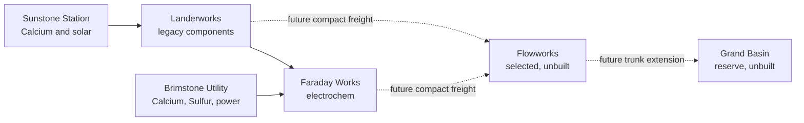

Created: 2026-07-11
Updated: 2026-07-11

Related: [[Topics/StarRupture/StarRupture|StarRupture]], [[Topics/StarRupture/Player save - operating model and factory architecture|Operating model and architecture]], [[Topics/StarRupture/Player save - play history|Play history]], [[Topics/StarRupture/World geography and named locations|World geography]], [[Topics/StarRupture/Player save - progression and next builds|Progression and next builds]], [[Projects/RuptureOps/RuptureOps|RuptureOps]]

# Player save - sites and freight network

Canonical registry for Rourke's named sites, confirmed installed state, and adopted planetary freight contracts as of July 11, 2026. It consolidates the imported Star Rupture Game Analysis package without treating its plans as completed construction.

Machine-readable baseline: [rourke-update1-save-baseline__20260711.json](</Users/Shared/projects/ruptureops/models/rourke-update1-save-baseline__20260711.json>)  
Machine-readable history: [rourke-update1-play-history__20260711.json](</Users/Shared/projects/ruptureops/models/rourke-update1-play-history__20260711.json>)

## Evidence vocabulary

- **Active:** directly reported as operating in the save.
- **Installed:** directly reported or explicitly recorded as placed.
- **Selected:** the location or role is adopted, but construction is not confirmed.
- **Planned:** an agreed design, not current save state.
- **Unknown:** the archive does not establish the current value.

## Canonical site roster

| Site | Code | Status | Durable role |
|---|---|---|---|
| **Landerworks** | `LW` | Active | Legacy Rotor, Stator, and Applicator exporter beside the initial lander. |
| **Sunstone Station** | `LW-SA` | Active satellite | Raw Calcium Ore and substantial solar generation for Landerworks. |
| **Faraday Works** | `FW` | Active | Rebuilt two-Core Titanium/Wolfram/Helium electrochem Works. |
| **Brimstone Utility** | `FW-BU` | Active critical satellite | Processed Calcium, Sulfur Ore, and all generation serving Faraday. |
| **First Geo Scanner fire base** | — | Temporary defense site; scanner completed | Powered-turret staging site for the first completed Geo Scanner; exact scanner/location not yet identified. |
| **Flowworks** | `FLW` | Site selected; not confirmed built | Planned Titanium/Wolfram mechanical Works between Landerworks and Faraday. |
| **Grand Basin Reserve** | `GBR` | Reserve selected; not confirmed built | Future multi-campus advanced-production region east of Mythic Cry. |

Use **Landerworks**, **Faraday**, **Flowworks**, and **Grand Basin** in normal conversation. `Base 1` and `Base 2` remain historical aliases. “Great Basin” in the final imported prompt was a one-off typo, not a renamed site.

## Named world map

![[assets/sites/world-map-named-sites.png]]

The dashed Landerworks–Flowworks–Faraday line is a relationship axis, not surveyed track geometry. Sunstone and Brimstone have known parent relationships but no registered exact pins.

## Current network

## Landerworks and Sunstone

Landerworks is the original base beside the initial lander. Its point-to-point, early-Satisfactory-style rail layout is visually tangled but operationally reliable. Its downstream buffers have prevented it from slowing Faraday.

Current contract:

- export Rotor, Stator, and Applicator;
- receive raw Calcium Ore from Sunstone;
- keep the high-volume Tube ancestry local behind Applicator;
- do not rebuild it merely to match a newer visual style;
- add a clean booster plant as another leaf only if one output buffer repeatedly fails to recover.

Sunstone is a subordinate resource/power satellite, not an independent production campus. Its exact terrain pin and machine counts remain unknown.

## Faraday Works

Faraday is immediately north of CRRO “Warm Dawn.” It has onsite Titanium, Wolfram, and Helium, but no generation. It imports processed Calcium, Sulfur Ore, and all power from Brimstone; it imports Rotor, Stator, and Applicator from Landerworks.

### Confirmed installed by July 11

| Infrastructure | Count or state |
|---|---:|
| Base Cores | 2, plus multiple Amplifiers |
| Chemicals machines | 3 |
| Electronics machines | 3 |
| Inductor Furnaces | 4 |
| HRS Furnaces | 2; 30 HRS/min combined at the recorded v1 rate |
| Hardening Agent machines | 2 |
| Pressurized Helium Pressurizer | 1 |
| Battery Mega Press | 1 |
| Sulphuric Acid Pressurizer | 1; recorded 120 Acid/min |
| Supermagnet Furnaces | 2; 40/min combined nameplate |
| Outbound Storage Depot v2 | 12; 19,200 source-side units |

Also confirmed in production: Basic Building Material, Intermediate Building Material, Standard Ammo, and Shotgun Ammo.

Not confirmed installed: an Electromagnetic Coil press, the future flexible Accumulator/Electromagnet Assembler, or any rebuilt Impeller/Nozzle/Valve/Turbine/Pump line.

### Second Supermagnet decision

The second Supermagnet Furnace was installed on July 11. Wolfram Plate capacity is sufficient, but the current Acid line cannot necessarily sustain Battery plus both Supermagnet Furnaces during a synchronized pull. That is intentional:

- treat the second Furnace as burst and recovery capacity;
- let buffers absorb ordinary demand;
- accept temporary underutilization rather than rebuilding Faraday again;
- put future campaign-scale Acid at Grand Basin;
- do not add a third Supermagnet Furnace without a measured shortage.

At full recorded nameplate, Battery plus two Supermagnet Furnaces request about 175 Acid/min against the 120/min Pressurizer. “Everything runs at line speed” therefore does not mean every Acid consumer can run at once indefinitely.

### Faraday freight boundary

Long-term production exports are expected to include HRS, bounded Acid, Helium for Flowworks, Chemicals, Hardening Agent, Electronics, Battery, Supermagnet, and later Coil and Accumulator. Electromagnet is a conditional campaign product, not a guaranteed permanent lane.

Construction and expedition supplies are a separate service layer. Basic/Intermediate Building Material and Standard/Shotgun Ammo should feed an on-demand Cargo rack rather than occupy every remote trunk continuously.

A future extension—not confirmed construction—is a Dispatcher/Receiver kit for temporary firebases and Geo Scanner assaults. It would pull ammunition and standard building materials near an expedition rather than keep those goods flowing on every production trunk.

Open Faraday facts:

- exact Core headroom after the second Supermagnet retrofit;
- exact assignment of the twelve outbound depots;
- whether Rail v3 permanently removed the Wolfram rail bottlenecks;
- whether the pure Titanium and merged Helium/Sulfur links still deliver only one source worth of flow;
- exact Wolfram Plate/Powder producer counts;
- Hardening Agent machine tier and actual recipe ownership.

## First Geo Scanner fire base

A temporary fire base is now confirmed at the first completed Geo Scanner, although the exact scanner and coordinates have not been identified. It ultimately had a claimed Regeneration Chamber and multiple powered turrets. An earlier attempt exposed two separate failure boundaries:

- unpowered turrets provide no defense even when physically installed;
- corruption of the contested base can take its Regeneration Chamber offline and invalidate the expected local respawn.

The base did not have a confirmed Cargo service. The broader reusable Dispatcher/Receiver idea therefore remains planned, not installed. Future scanner sites should add a separate safe recovery cache containing replacement weapons, ammunition, healing, and rebuilding supplies rather than relying entirely on equipment inside the contested fire base.

## Brimstone Utility

Brimstone produces Calcium Powder and Blocks, sends Sulfur Ore, and contains all generation serving Faraday. It is a critical utility complex, not a disposable mining spur. Because Faraday has no onsite generation, the Faraday–Brimstone rail/power path is a single important failure boundary and should remain simple and protected.

## Flowworks

Flowworks is selected between Landerworks and Faraday on a broad field with Titanium and Wolfram nearby. No Core or production placement is confirmed.

Adopted contract:

- make Titanium/Wolfram bulk shapes locally;
- own Stabilizer, Nozzle, Impeller, Valve, Turbine, and Pump;
- import HRS, bounded Acid, Helium, Rotor, and Stator through buffers;
- attach to the Landerworks–Faraday through trunk with one storage-yard spur;
- never make the Flowworks machine network a transit path;
- begin with one Core and preserve one expansion edge.

See [[Topics/StarRupture/Player save - progression and next builds#Flowworks staged build|Flowworks staged build]] for machine counts.

## Grand Basin Reserve

Grand Basin is the broad basin immediately east of GRO “Mythic Cry,” not the earlier provisional Red Lake/Redleaf match. It is north of the active production corridor and has a large, flat northern/northwestern pad.

Nearby ordinary resources support several separated campuses: Titanium, Wolfram, Helium, Sulfur, and Calcium. Goethite and Oil are not onsite and require satellites.

Preserve before construction:

- a straight freight corridor along an edge;
- at least two possible intersite approaches;
- an unbroken central machine field;
- separate initial plots for GB-A, GB-B, and GB-C;
- a combat exclusion strip beside Mythic Cry's mountain/POI boundary;
- the Geo Scanner near `3059,2618` outside the first build district.

Logical families are GB-A chemistry, GB-B biotech, GB-C alloys/structures, GB-D advanced assembly, and GB-E final products/exports. These are ownership boundaries, not a requirement for exactly five Cores.

See [[Topics/StarRupture/Remote resource satellites - Goethite and Oil|Remote resource satellites]] and [[Topics/StarRupture/Player save - progression and next builds#First Grand Basin build|First Grand Basin build]].

## Planetary freight rules

- Use a buffered pull tree: every producer joins once as a leaf.
- Do not let a feeder leave and later rejoin the same network.
- Give every exported item a visible source and destination buffer.
- Terminate world freight at each site's storage yard.
- Keep machines, Corporation sinks, and campaign stores off the world trunk.
- Make Ore, Bars, and high-rate shapes beside their consumers.
- Move compact, complexity-dense products between specialist sites.
- Chemicals may remain one deliberately heavy centralized concentrate.
- Acid may cross for bounded Flowworks demand; Grand Basin makes campaign Acid locally.
- Plan routine shared-trunk traffic around 240–300/min to preserve refill-wave headroom under Rail v3's 480/min.
- Reserve a second right-of-way, but split only when stocked sources coexist with slow destination recovery.
- Remember that connected rails also join sites into an electrical failure domain; Core heat remains local.

## Source boundary

This note consolidates direct player statements and the verified imported planning package. The complete original is preserved locally under [the import ledger](</Users/Shared/projects/ruptureops/imports/star-rupture-game-analysis__20260708T190137Z/README.md>). Numerical claims retain the RuptureOps source-snapshot boundary; the archive's simplified `23761620` dataset label was not adopted.
