Related: [[Brunn]]

Source: converted from [[Records/Retained PDFs/Brunn/Portable Personal Context Layer - 2026-07-10.pdf|Portable Personal Context Layer PDF]], pages 22-35.

# Dreaming Architecture and Plan - Initial Design
## Decision
This is the canonical initial design for the Personal Context Layer's dreaming
architecture and process, locked by Rourke McNamara on July 10, 2026.
It operationalizes the offline dreaming plane established in [[Write API and Dreaming - Initial Design]] and works through the reasoning
surface defined in [[Retrieval API - Initial Design]]. It does
not replace either contract.
Research was reviewed through July 10, 2026. Several of the most directly
relevant results are recent preprints, so the architecture below treats their
findings as strong design signals rather than settled science.
## Executive Recommendation
**Treat dreaming as a reversible compiler for memory, not as a process that
rewrites truth.**
The system should have an immutable evidence ledger and a separately versioned
derived-memory layer. A dream reads a snapshot-pinned, project-sized region;
reopens the raw evidence; creates a candidate derived revision,verifies
every transition; compares retrieval and reasoning before versus after; and
only then promotes safe derived changes through an atomic active-manifest
swap. Canonical changes remain proposals for review.
The governing rule is:
> **The evidence ledger is memory. The consolidated layer is a disposable,
versioned optimization over that evidence.**
This preserves the benefit of offline consolidation without creating a
semantic telephone game in which summaries are repeatedly rewritten from
older summaries.
## What The Research Changes
The existing two-timescale design is correct, but the evidence supports six
stronger constraints:

1. **Dreaming must be source-preserving.** Raw episodes, artifacts, explicit
memories, corrections, and versions remain first-class and immutable.
2. **Deduplication comes before abstraction.** Abstractive summaries are
additional views, never the only surviving representation.
3. **Dreams build shadow revisions.** They do not mutate the active corpus in
place.
4. **Dreaming is region- and event-driven.** A nightly window may provide
compute, but the real trigger is accumulated evidence, recurrence, conflict,
memory pressure, import completion, retrieval failure, or a task boundary.
5. **Every transition is verified.** Coverage, preservation, faithfulness,
temporal validity, authority, and downstream retrieval must all pass before
promotion.
6. **Temporal and policy semantics are deterministic.** Valid time,
transaction time, TTL, ACLs, deletion, supersession chains, and scope
boundaries are database rules rather than free-form model judgments.
## Research Findings
### 1. Continuous rewriting can make memory worse than no memory
[Useful Memories Become Faulty When Continuously Updated by
LLMs](https://arxiv.org/abs/2605.12978) finds that consolidated-memory
utility can improve and then degrade below a no-memory baseline. Even when
consolidation began with ground-truth solutions, GPT-5.4 failed on 54% of a
set of ARC-AGI problems it had previously solved without memory. Agents
allowed to choose their memory action preserved raw episodes by default and
doubled the accuracy of forced-consolidation agents.
**Implication:** never make a recursively rewritten abstraction the sole
memory. Preserve raw episodes and gate consolidation explicitly.
### 2. Aggressive cluster-and-summarize consolidation destroys load-bearing
detail
[Human-Inspired Memory Architecture](https://arxiv.org/abs/2605. 08538) reports
that deduplication-based consolidation reached 97.2% retention precision with
a 58% store reduction on 120,000 VS Code events. On LongMemEval S-tier,
dedup-only scored 76.8% versus 78.4% for raw RAG with overlapping confidence
intervals, while aggressive clustering and summarization fell to 48.4%
because specific details were lost.
**Implication:** automatic consolidation should initially focus on exact and
near-exact deduplication, indexing, links, and derived views. A summary may
help retrieval, but it must point to and coexist with concrete evidence.
### 3. Offline consolidation works best as a bounded, provenance-aware job
[Auto-Dreamer](https://arxiv.org/abs/2605.20616) separates fast per-session
acquisition from slow cross-session consolidation. It freezes a selected
region of typed memory as read-only evidence, lets the consolidator inspect
provenance-linked source trajectories, and produces a compact replacement
candidate. It gained seven points on ScienceWorld with a 12-times smaller
active memory bank and transferred to ALFWorld and WebArena.

**Implication:** use bounded, homogeneous working regions and source-linked
tool use. For a personal corpus, use Auto-Dreamer's replacement set as a
candidate active view, not permission to delete its evidence.
### 4. Consolidation itself needs a transition verifier
[TrustMem](https://arxiv.org/abs/2606.25161) evaluates memory updates for
coverage, preservation, and faithfulness. It reports 40.1% fewer omissions,
79.1% less corruption, and 50% fewer hallucinated transition errors than the
strongest respective baselines.
**Implication:** a good downstream answer is not sufficient proof that a
memory mutation was safe. Every candidate revision needs a claim-level
transition audit.
### 5. Recurrence is a better trigger than processing every interaction
[RecMem](https://arxiv.org/abs/2605.16045) stores incoming interactions
cheaply and invokes LLM consolidation only after sustained recurrence among
semantically similar interactions. It reports up to an 87% reduction in
memory-construction token cost while improving accuracy, and adds a
refinement pass to recover fine-grained facts omitted during extraction.
**Implication:** recurrence and evidence density should raise a region's dream
priority. A clock should decide when compute is available, not whether a
region deserves consolidation.
### 6. Abstraction and specificity should coexist structurally
[Memora](https://arxiv.org/abs/2602.03315) uses primary abstractions to index
concrete memory values and cue anchors to provide multiple retrieval paths
across related memories. [EverMemOS](https://arxiv.org/abs/2601. 02163)
similarly separates episodic traces and atomic facts from thematic
consolidated scenes.
**Implication:** compiled project, person, topic, and procedural views should
be indexes into specific claims and artifacts. They should not flatten those
objects into one prose record.
### 7. Freshness is partly a deterministic assembly problem
[Don't Ask the LLM to Track Freshness](https://arxiv.org/abs/260 6.01435) shows
weak results when published memory systems leave a benchmark's current-value
conflict to LLM judgment. In that deliberately serial-numbered setting,
candidate extraction followed by deterministic selection reached 78.0% with
GPT-4o-mini and 94.8% with GPT-4o. The authors correctly note that
'max(timestamp)' alone does not solve historical, yes/no, aggregation, or
more general temporal questions.
**Implication:** the system should store authority, valid time, observed time,
correction, and supersession explicitly. The model identifies the question
type; deterministic code applies the appropriate temporal operator.
### 8. Offline compute is most valuable when future questions are predictable

[Sleep-time Compute](https://arxiv.org/abs/2504.13171) reports roughly
five-times less test-time compute for the same accuracy on its stateful
reasoning tasks and finds that benefit correlates with predictability of
future queries.
**Implication:** dream priority should rise for active projects and recurring
workflows where likely future questions are known. A dream can precompute
project state, timelines, comparison tables, decision histories, and reusable
procedures. It should not free-associate new canonical truths.
### 9. Production systems reinforce separation, idle execution, and
reversibility
- [ChatGPT Dreaming](https://openai.com/index/chatgpt-memory-dre aming/) uses a
background process to synthesize memory across many conversations and
explicitly positions dreaming as complementary to explicit saved memories
rather than historically sufficient on its own.
- [Anthropic Managed Agents
Dreams](https://platform.claude.com/docs/en/managed-agents/dream s) reads an
input memory store and up to 100 sessions, then creates a separate output
store. It never modifies the input, and the output can be reviewed, used,
archived, or discarded.
- [Letta](https://docs.letta.com/letta-agent/memory) runs dream subagents on
step-count or context-compaction triggers and stores memory in a Git-backed
repository with worktrees, inspection, version history, and merge behavior.
[Honcho](https://honcho.dev/docs/v3/documentation/features/advan ced/dreaming)
uses evidence-volume, cooldown, and idle-time conditions; prevents concurrent
dreams in one scope; and cancels a pending dream when new activity arrives.
Its documented thresholds are an experimental implementation example, not
universal constants.
**Implication:** use an asynchronous job with a stable status, immutable input
revision, isolated candidate output, explicit scope, user-visible history,
and instant rollback. Do not copy any product's opaque rewrite authority or
fixed thresholds without local evidence.
### 10. Memory evaluation must inspect operations, not just final answers
[HaluMem](https://arxiv.org/abs/2511.03506) evaluates extraction, updating,
and question answering separately and finds that hallucinations created
during memory operations propagate into later answers.
**Implication:** evaluate capture, transition safety, retrieval, and
downstream reasoning independently. A polished answer can hide a corrupt
intermediate memory state.
## Recommended Architecture

```mermaid
flowchart LR
    W["Online capture<br/>memory.save"] --> E["Immutable evidence ledger<br/>episodes, claims, artifacts, versions"]
    E --> A["Current active memory<br/>canonical state + selected evidence"]
    E --> S["Dream scheduler<br/>per-region dirty score"]
    A --> S
    L["Retrieval and correction signals"] --> S
    S --> R["Snapshot-pinned dream region"]
    R --> D["Dream worker<br/>deduplicate, link, abstract, compile"]
    D --> C["Candidate derived revision<br/>shadow store"]
    C --> V["Transition verifier<br/>source, temporal, authority, policy"]
    V --> Q["Pre/post retrieval and reasoning eval"]
    Q -->|"safe derived changes"| P["Atomic promotion<br/>active manifest pointer"]
    Q -->|"canonical or risky changes"| H["Review queue"]
    Q -->|"regression"| X["Quarantine or discard"]
    P --> M["Monitored active revision<br/>rollback available"]
    M --> L
    H --> P
```


### 1. Evidence plane
The evidence plane is immutable and authoritative about what was observed or
asserted. It contains:
- exact turn spans and explicit user memories
- source-native records and artifact versions
- extracted claims with epistemic status
- user corrections and retractions
- project, booking, cost, constraint, decision, and task-state events
- valid time and transaction time
- content hashes, source identity, authority, sensitivity, and trust-domain
policy
A dream cannot edit this plane. A source correction creates a new event and
invalidates dependent derived objects through lineage.
### 2. Active memory plane
The active plane contains the current retrieval surface:
- canonical structured state selected through explicit rules or user authority
- protected explicit memories and corrections
- current artifact pointers and task checkpoints
- selected episodic evidence needed for exact and current-state retrieval
- active derived views that have passed promotion gates
Compaction means changing what is active by a reversible manifest. It does not
mean destroying the underlying records.
### 3. Derived-memory plane
Dream-generated objects live here:
- compiled project, topic, person, and procedure views
- temporal narratives and decision histories
- aliases, cue anchors, relationship edges, and duplicate clusters
- conditional patterns with supporting and counterevidence
- retrieval-specific indexes, chunks, embeddings, and query aids
- staleness, contradiction, source-availability, and confidence flags

Every derived assertion must link directly to raw source evidence. A derived
view may cite another derived view for navigation, but its truth lineage
cannot stop there.
### 4. Dream control plane
The control plane owns:
- per-region watermarks and dirty scores
- scheduling, cooldowns, budgets, and locks
- snapshot and region manifests
- job state, retries, cancellation, and stale-base detection
- model, prompt, schema, policy, and
evaluator versions
- proposed and applied diffs
- promotion, review, rollback, and audit receipts
### 5. Evaluation plane
The evaluation plane contains:
- real historical queries for the region
- claim-derived exact and temporal
probes
- fixed golden continuation tasks
- held-out and adversarial queries
- baseline and candidate retrieval traces
- correctness, evidence-chain, temporal, abstention, and citation results
- live correction and wrong-memory signals after promotion
## Two Dream Loops
### Loop A: deterministic maintenance
Run cheaply and frequently without asking a model to adjudicate truth:
- exact byte and source-identity deduplication
- index and embedding refresh
- safe rechunking and parent-child reconstruction
- TTL, validity-window, source-availability, and deletion propagation
- broken-reference and orphan detection
- duplicate-candidate and conflict-candidate generation
- derived-object invalidation when evidence or permissions change
This is maintenance, even if the product groups it under dreaming.
### Loop B: model-based consolidation
Run less frequently over a bounded region with a strong reasoning model:
- inspect related memories and their source trajectories
- identify semantic duplicates, updates, contextual variants, and genuine
contradictions
- build compiled project, topic, procedure, and temporal views
- discover soft relationships and retrieval cues
- form conditional patterns with supporting examples and counterexamples
- propose active/archive changes, merges, and supersessions
- construct likely future query artifacts for recurring work
This loop writes only to a candidate branch.

## Scheduler Recommendation
Use a hybrid scheduler. The scheduler wakes on a clock, but it runs a deep
dream only for an eligible dirty region.
### High-priority triggers
- content-pack import completed
- explicit user correction or retraction
- new contradiction or temporal-overlap cluster
- enough independent evidence accumulated around a recurring pattern
- substantial project, artifact, or entity growth
- repeated retrieval failure, query reformulation, or user correction
- active-memory budget exceeded
- task or project milestone completed
- validity or review deadline reached
- explicit user request to dream, repair, or reorganize
### Background triggers
- idle compute availability
- daily scan of active projects
- weekly sampling of cold regions
- periodic provenance, deletion, and index-integrity audit
### Initial scheduling behavior
- debounce deep consolidation until the user has been inactive for 30-60
minutes
- cancel or rebase a pending job when relevant new evidence arrives
- allow only one promoting dream on overlapping regions
- apply a per-region cooldown after promotion
- enforce minimum evidence, maximum region size, and per-user compute budgets
- permit a manual run now, pause by scope, and repair-only mode
- tune volume and recurrence thresholds from real corpus behavior rather than
copying another product's constants
The scheduler should expose separate watermarks for source capture, online
formation, consolidation, and indexes. A successful save must never imply
that every derived view is already current.
## Dream Region Selection
A region is an ephemeral working set, not a permanent semantic partition.
### Hard boundaries
A region never spans:
- personal and work instances
- separate user identities
- incompatible authorization or retention policies
- disallowed projects, namespaces, or sensitivity domains
- imported data carrying incompatible no-repersist or no-reexport controls
Derived objects inherit the most restrictive policy of their evidence.
### Seed signals

Start with:
- new writes since the region watermark
- older memories co-retrieved with those writes
- corrections, contradictions, and near-duplicate candidates
- dense growth in one project, artifact, entity, or procedure
- retrieval failures and repeated reformulations
- newly staged imports
### Required expansion
Before synthesis, add:
- complete correction and supersession chains
- current canonical state
- raw source artifacts and source-native spans
- parent and neighboring blocks
- exact, lexical, semantic, temporal, and relational neighbors
- known counterexamples and failed episodes
- pinned rare details such as dates, amounts, identifiers, bookings, statuses,
and version pointers
- a boundary sample of similar-looking material outside the proposed region
Use project, artifact, memory class, entity, task family, and time as split
keys. If the expanded region exceeds budget, split it; never truncate
silently. Do not mix unrelated task families simply because their embeddings
are close.
## Dream Process
```text
ELIGIBLE
-> SELECT_REGION
-> PIN_SNAPSHOT
-> EXPAND_EVIDENCE
-> GENERATE_CANDIDATE
-> CLAIM_AND_TRANSITION_AUDIT
-> BUILD_SHADOW_REVISION
-> RUN_PRE_POST_EVALS
-> AUTHORITY_GATE
     -> QUARANTINED
     -> AWAITING_REVIEW
     -> CANARY
-> PROMOTED
-> MONITORED
     -> ROLLED_BACK when later evidence invalidates the revision
```

### 1. Select and pin
Record the trigger, scope, region manifest, base corpus revision, evidence
watermark, policy version, compute budget, and expected future query families.
### 2. Expand evidence

Use the reasoning-first retrieval API to reopen source-native evidence,
complete artifacts, temporal neighbors, contradictions, and boundary cases.
The dreamer must not synthesize from retrieved snippets alone when full
source material is available.
### 3. Classify before combining
For every candidate relationship, distinguish:
- exact duplicate
- same fact restated
- newer state for the same valid-time subject
- contextual variant that should coexist
- genuine contradiction
- related but independent information
- unsupported similarity
Frequency is not authority. Repeated model output does not outrank one
authenticated user correction.
### 4. Generate a candidate revision
Create new derived objects and a disposition map for every affected active
item:
```text
keep
represented_by
candidate-demote
candidate_supersede
conflict
unresolved
```

In the initial system, an item omitted from this map stays active. There is no
omission-based forgetting.
### 5. Verify every transition
An independent verifier decomposes candidate views into atomic claims and
checks:
- direct support from exact source spans
- preservation of valid old evidence
- names, dates, numbers, units, negation, status, and conditions
- temporal and authority correctness
- explicit treatment of disagreement and counterexamples
- no policy, scope, or instruction-boundary escalation
- no claim whose lineage ends at another model summary
The model is one auditor, not the final authority. Deterministic code applies
hard invariants.
### 6. Run pre/post reasoning tests

Build the candidate indexes, then answer the same frozen query suite against
the active and candidate revisions with the same
reader, tool budget, and
retrieval policy. Test multiple reader-model families in release evaluation
and for high-impact dreams so the memory is not overfit to its author model.
### 7. Apply the authority gate
Safe derived operations may proceed to canary. Canonical or destructive
proposals wait for review. Any integrity, grounding, or critical regression
failure quarantines the candidate.
### 8. Promote atomically
Promotion creates an immutable corpus revision and swaps one active-manifest
pointer. If the base revision or an affected object changed, reselect and
rerun rather than patching a stale candidate onto live memory.
### 9. Canary and monitor
Run paired retrieval against the prior and promoted revisions for the next
relevant queries. Track selected evidence, corrections, ignored results,
retrieval failures, and
source invalidations. Rollback
is a manifest-pointer
swap, not a reconstruction from compressed memory.
## Authority Matrix
| Dream result | Initial authority |
| --- | --- |
| Rechunking, indexes, embeddings, exact duplicate storage deduplication | Automatic |
| Derived summaries clearly labeled 'derived' | Automatic after gates |
| Search aliases, cue anchors, and soft relationship edges | Automatic after gates |
| Duplicate clusters without destructive merge | Automatic after gates |
| Contradiction, staleness, expiry, and source-availability flags | Automatic after gates |
| Replacement of an older derived view by a better derived view | Automatic after gates and rollback support |
| Reversible active/archive classification of noncanonical derived material | Automatic after gates |
| Canonical merge or supersession | Review or explicit policy authority |
| Demotion of explicit user memory or canonical project state | Review |
| Promotion of an inference into a stable preference or people judgment | Review or prohibited by sensitivity policy |
| New global governing instruction | Explicit user authority |
| Scope, visibility, trust-domain, or export-policy change | Explicit authority |
| Deletion, destructive merge, or source removal | Separate deletion workflow; never a dream side effect |
## Promotion Gates
### Hard invariants
- all references and hashes resolve
- raw evidence and immutable versions are unchanged
- every derived claim has direct source lineage

- all protected facts and artifact pointers remain retrievable
- no trust-boundary, ACL, retention, no-repersist, or no-reexport violation
- valid-time and transaction-time intervals are structurally valid
- no accidental second canonical head
- no broken correction, supersession, artifact, or deletion chain
- complete disposition mapping for affected items
- candidate application is idempotent
- base and affected-object revisions are current
### Regression suite
The fixed and generated test set should include:
- exact identifiers, dates, costs, bookings, and current status
- historical versus current-state questions
- corrections, supersession, and contradictions
- multi-hop evidence chains
- complete-artifact and project-continuation questions
- negative and abstention questions
- rare-detail probes
- preference questions with and without enough recurrence
- source deletion and permission-revocation behavior
- prompt injection inside a source or content pack
- the vacation-planning continuation test
- a large artifact-rich
project such
as the StarRupture continuation test
### Metrics
Prioritize:
1. final-answer correctness and completeness
2. complete evidence-chain recall
3. pinned-fact and exact-value retention
4. temporal and supersession accuracy
5. contradiction preservation and abstention
6. direct provenance and citation fidelity
7. full-artifact and project-continuation comprehension
8. unsupported-claim, omission, corruption, and false-merge rates
9. user correction and wrong-memory rate after promotion
10. active-memory size, tokens, latency, and cost
Compactness is considered only among candidates that pass correctness and
preservation gates. Aggregate gains cannot hide a collapse in one critical
task family.
## Model Topology
The initial implementation does not need a society of agents.
Use:
1. one strong dream worker with the full reasoning-first retrieval surface
2. deterministic workers for exact deduplication, temporal rules, policy,
deletion propagation, indexes, and invariants
3. one independently prompted
evidence-and-transition verifier
4. frozen reader evaluations comparing active and candidate revisions

5. a second heterogeneous red-team model only for high-impact proposals and
offline release evaluation
The dream model may be larger and slower than the online capture model because
it is off the latency path. Model agreement is not proof; all evaluators must
return evidence references, and a deterministic hard failure vetoes consensus.
## Job Contract
Every dream run should expose:
```json
{
  "dream_id": "dream:2026-07-10:trip-2026:0042",
  "status": "evaluating",
  "job_type": "deep_consolidation",
  "trigger": ["project_growth", "recurrence"],
  "scope": "project:trip-2026",
  "base_revision": "rev_9182",
  "evidence_watermark": "event_8844",
  "region_manifest": "region:trip-2026@17",
  "policy_version": "dream-policy:v1",
  "model_version": "...",
  "candidate_revision": "shadow_981",
  "evaluation": "dream-eval:552",
  "pending_review": [],
  "rollback_to": "rev_9182"
}
```

Supported terminal states should include 'promoted', 'awaiting_review',
'quarantined', 'discarded', 'failed', 'canceled', 'stale', and 'rolled_back'.
Partial candidate output may remain inspectable after failure, but it never
becomes active.
## MVP Recommendation
### Phase 0: shadow-only learning
- run deterministic maintenance and deep dreams without changing the active
corpus
- compare candidate retrieval against current retrieval on historical and
generated queries
- inspect false merges, omissions, source grounding, and proposed authority
changes
- collect which proposals the user accepts, rejects, or corrects
- tune region selection and scheduling from actual corpus behavior
### Phase 1: safe derived promotion
Automatically promote only:
- indexes and chunks
- aliases and cue anchors
- soft relationships
- duplicate and conflict clusters
- staleness and source-availability flags

- additive compiled views with complete source lineage
- replacement of prior derived views
Keep canonical facts, explicit memories, user preferences, deletion, merges,
and supersession review-only.
### Phase 2: reversible active-surface compaction
After longitudinal evidence shows no material regression:
- allow automatic demotion of redundant noncanonical derived material
- retain raw episodes and a direct episodic fallback
- preserve rollback and historical manifests
- continue running query-family and cross-model regression tests
### Later: learn the policy, not the truth
Use accepted and rejected dream proposals, retrieval outcomes, corrections,
and downstream task performance to improve:
- which region to dream
- when to run
- which representation to generate
- how much compute to allocate
- which candidates merit review
Do not train a model to assign itself more authority. User assertions, source
authority, scope, temporal rules, and deletion policy remain explicit system
semantics.
## Product Controls
Expose:
- last captured, last consolidated, and index freshness separately
- inspectable source links for every derived view
- candidate diff and dream receipt
- pause and resume by project or scope
- manual run-now and repair-only actions
- protected explicit memories
- correction that takes effect immediately without waiting for a dream
- version history, restore, and rollback
- incognito or no-capture sessions
- a deletion path that reaches sources, claims, derived views, embeddings,
indexes, caches, exports, and replicas
"Do not mention" and "delete" must remain different operations.
## Bottom Line
The right initial dreamer is conservative in authority and ambitious in
reasoning. It can inspect broadly, make rich connections, compile excellent
project views, and spend real offline compute. But it treats its output as a
hypothesis until that output is source-grounded, transition-safe,
demonstrably better for retrieval and reasoning, and reversibly promoted.

That is the architecture most likely to improve the core product objective:
helping a model reason better over a growing personal corpus without
gradually replacing the user's actual history with plausible model prose.
## Related Vault Notes
- [[Portable Personal Context Layer]]
- [[Retrieval API - Initial Design]]
- [[Write API and Dreaming - Initial Design]]
- [[Memory Usage Audit - 2026-07-10]] (referenced by the source PDF but not included in it)
